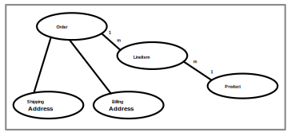

//
// Copyright (c) 2017, 2023 Contributors to the Eclipse Foundation
//

== Query Language [[a4665]]

The Jakarta Persistence query language is a
string-based query language used to define queries over entities and
their persistent state. It enables the application developer to specify
the semantics of queries in a portable way, independent of the
particular database schema in use in an enterprise environment. The full
range of the language may be used in both static and dynamic queries.

This chapter provides the full definition of
the Jakarta Persistence query language.

=== Overview

The Jakarta Persistence query language is a
query specification language for string-based dynamic queries and static
queries expressed through metadata. It is used to define queries over
the persistent entities defined by this specification and their
persistent state and relationships.

The Jakarta Persistence query language can be
compiled to a target language, such as SQL, of a database or other
persistent store. This allows the execution of queries to be shifted to
the native language facilities provided by the database, instead of
requiring queries to be executed on the runtime representation of the
entity state. As a result, query methods can be optimizable as well as
portable.

The query language uses the abstract
persistence schema of entities, including their embedded objects and
relationships, for its data model, and it defines operators and
expressions based on this data model. It uses a SQL-like syntax to
select objects or values based on abstract schema types and
relationships. It is possible to parse and validate queries before
entities are deployed.

[NOTE]
====
The term abstract persistence schema refers
to the persistent schema abstraction (persistent entities, their state,
and their relationships) over which Jakarta Persistence queries operate.
Queries over this persistent schema abstraction are translated into
queries that are executed over the database schema to which entities are
mapped.
====

Queries may be defined in metadata
annotations or the XML descriptor. The abstract schema types of a set of
entities can be used in a query if the entities are defined in the same
persistence unit as the query. Path expressions allow for navigation
over relationships defined in the persistence unit.

[NOTE]
====
A persistence unit defines the set of all
classes that are related or grouped by the application and which must be
colocated in their mapping to a single database.
====

=== Statement Types

A Jakarta Persistence query language statement
may be either a select statement, an update statement, or a delete
statement.

[NOTE]
====
This chapter refers to all such statements as
“queries”. Where it is important to distinguish among statement types,
the specific statement type is referenced.
====

In BNF syntax, a query language statement is
defined as:

----
QL_statement ::= select_statement | update_statement | delete_statement
----

Any Jakarta Persistence query language statement
may be constructed dynamically or may be statically defined in a
metadata annotation or XML descriptor element.

All statement types may have parameters.

==== Select Statements

A select query is a string with the following clauses:

* a `SELECT` clause, which determines the type of
the objects or values to be selected.
* a `FROM` clause, which provides declarations
that designate the domain to which the expressions specified in the
other clauses of the query apply.
* an optional `WHERE` clause, which may be used
to restrict the results that are returned by the query.
* an optional `GROUP BY` clause, which allows
query results to be aggregated in terms of groups.
* an optional `HAVING` clause, which allows
filtering over aggregated groups.
* an optional `ORDER BY` clause, which may be
used to order the results that are returned by the query.

In BNF syntax, a select query is defined by:

----
select_query ::= [select_clause]? from_clause [where_clause] [groupby_clause] [having_clause] [orderby_clause]
----

Every select statement has a `FROM` clause. The square brackets `[]` in the
BNF indicate that the other clauses are optional.

===== Set Operators in Select Statements

A select statement may be a single select query, or it may combine
multiple select queries using the binary left-associative operators
`UNION`, `UNION ALL`, `INTERSECT`, `INTERSECT ALL`, `EXCEPT`, and
`EXCEPT ALL`. The semantics of these operators are identical to SQL.
footnote:[As in SQL, the `INTERSECT` and `INTERSECT ALL` operations have
higher precedence than `UNION`, `UNION ALL`, `EXCEPT`, and `EXCEPT ALL`.]

The full syntax for a select statement is defined by:

----
select_statement ::= union
union ::= intersection | union {UNION [ALL] | EXCEPT [ALL]} intersection
intersection ::= query_expression | intersection INTERSECT [ALL] query_expression
query_expression ::= select_query | (union)
----

A provider is only required to support select statements where every
constituent select query has the same number of items in the select
clause, and where corresponding items in the select clauses of the
constituent select queries either:

- have exactly the same type, as defined by <<a5439>>, or
- are entity types which inherit a common entity type, as defined
  by <<a765>>.

==== Update and Delete Statements

Update and delete statements provide bulk
operations over sets of entities.

In BNF syntax, these operations are defined by:

----
update_statement ::= update_clause [where_clause]
delete_statement ::= delete_clause [where_clause]
----

The update and delete clauses determine the
type of the entities to be updated or deleted. The `WHERE` clause may be
used to restrict the scope of the update or delete operation.

Update and delete statements are described
further in <<a5636>>.

=== Abstract Schema Types and Query Domains

The Jakarta Persistence query language is a
typed language, and every expression has a type. The type of an
expression is derived from the structure of the expression, the abstract
schema types of the identification variable declarations, the types to
which the persistent attributes evaluate, and the types of literals.

The abstract schema type of an entity or
embeddable is derived from its class and the metadata information
provided by Java language annotations or in the XML descriptor.

Informally, the abstract schema type of an
entity or embeddable can be characterized as follows:

* For every non-relationship persistent field
or get accessor method (for a persistent property) of the class, there
is a field (“state field”) whose abstract schema type corresponds to
that of the field or the result type of the accessor method.
* For every persistent relationship field or
get accessor method (for a persistent relationship property) of the
class, there is a field (“association field”) whose type is the abstract
schema type of the related entity (or, if the relationship is a
one-to-many or many-to-many, a collection of such).

Abstract schema types are specific to the
query language data model. The persistence provider is not required to
implement or otherwise materialize an abstract schema type.

The domain of a query consists of the
abstract schema types of all entities and embeddables that are defined
in the same persistence unit.

The domain of a query may be restricted by
the _navigability_ of the relationships of the entity and associated
embeddable classes on which it is based. The association fields of an
entity's or embeddable's abstract schema type determine navigability.
Using the association fields and their values, a query can select
related entities and use their abstract schema types in the query.

==== Naming [[naming]]

Entities are designated in query strings by
their entity names. The entity name is defined by the `name` element of
the `Entity` annotation (or the `entity-name` XML descriptor element),
and defaults to the unqualified name of the entity class. Entity names
are scoped within the persistence unit and must be unique within the
persistence unit.

==== Example [[a4713]]

This example assumes that the application
developer provides several entity classes, representing orders,
products, and line items, and an embeddable address class representing
shipping addresses and billing addresses. The abstract schema types for
the entities are `Order`, `Product`, and `LineItem` respectively.
There is a one-to-many relationship between `Order` and `LineItem`. The
entity `LineItem` is related to `Product` in a many-to-one relationship.
The classes are logically in the same persistence unit, as shown in
<<a4724>>.

Queries to select orders can be defined by
navigating over the association fields and state fields defined by
`Order` and `LineItem`. A query to find all orders with pending line
items might be written as follows:

[source,sql]
----
SELECT DISTINCT o
FROM Order AS o JOIN o.lineItems AS l
WHERE l.shipped = FALSE
----

.Abstract persistence schema of several entities defined in the same persistence unit.
[[a4724]]

This query navigates over the association
field `lineItems` of the abstract schema type `Order` to find line
items, and uses the state field `shipped` of `LineItem` to select those
orders that have at least one line item that has not yet shipped. (Note
that this query does not select orders that have no line items.)

Although reserved identifiers, such as
`DISTINCT`, `FROM`, `AS`, `JOIN`, `WHERE`, and `FALSE` appear in upper
case in this example, reserved identifiers are case
insensitive.footnote:[This chapter uses the
convention that reserved identifiers appear in upper case in the
examples and BNF for the language.]

The `SELECT` clause of this example designates
the return type of this query to be of type `Order`.

Because the same persistence unit defines the
abstract persistence schema of the related entities, the developer can
also specify a query over orders that utilizes the abstract schema type
for products, and hence the state fields and association fields of both
the abstract schema types `Order` and `Product`. For example, if the
abstract schema type `Product` has a state field named `productType`, a
query over orders can be specified using this state field. Such a query
might be to find all orders for products with product type office
supplies. A query for this might be as follows.

[source,sql]
----
SELECT DISTINCT o
FROM Order o JOIN o.lineItems l JOIN l.product p
WHERE p.productType = 'office_supplies'
----

Because `Order` is related to `Product` by
means of the relationships between `Order` and `LineItem` and between
`LineItem` and `Product`, navigation using the association fields
`lineItems` and `product` is used to express the query. This query is
specified by using the entity name `Order`, which designates the
abstract schema type over which the query ranges. The basis for the
navigation is provided by the association fields `lineItems` and
`product` of the abstract schema types `Order` and `LineItem` respectively.

=== The FROM Clause and Navigational Declarations

The `FROM` clause of a query defines the _domain_ of the query:

- one or more named entity abstract schema types, as specified below
  in <<a4766>>, together with
- zero or more joined associations and collections, as specified
  below in <<joins>>.

An _identification variable_ is an identifier declared in the `FROM`
clause of a query. Each identification variable is assigned an
abstract schema type. Each element of the domain may declare an
identification variable.

- If the domain has exactly one named entity abstract schema type
  and no joins, then the named entity does not require an explicit
  identification variable, and its identification variable defaults
  to the _implicit identification variable,_ `this`.
- Otherwise, every element of the `FROM` clause--that is, every
  named entity abstract schema types and every join--must
  declare an identification variable.

----
from_clause ::=
    FROM {this_implicit_variable | identification_variable_declarations}

this_implicit_variable ::= entity_name

identification_variable_declarations ::=
    identification_variable_declaration
    {, {identification_variable_declaration | collection_member_declaration}}*

identification_variable_declaration ::= range_variable_declaration {join | fetch_join}*

range_variable_declaration ::= entity_name [AS] identification_variable

join ::= range_join | path_join

range_join ::= join_spec range_variable_declaration [join_condition]

path_join ::=
    join_spec join_association_path_expression [AS] identification_variable [join_condition]

fetch_join ::= join_spec FETCH join_association_path_expression

join_spec ::= [INNER | LEFT [OUTER]] JOIN

join_association_path_expression ::=
    join_collection_valued_path_expression |
    join_single_valued_path_expression |
    TREAT(join_collection_valued_path_expression AS subtype) |
    TREAT(join_single_valued_path_expression AS subtype)

join_collection_valued_path_expression ::= [identification_variable.]{single_valued_embeddable_object_field.}*collection_valued_field

join_single_valued_path_expression ::= [identification_variable.]{single_valued_embeddable_object_field.}*single_valued_object_field

join_condition ::= ON conditional_expression

collection_member_declaration ::= IN (collection_valued_path_expression) [AS] identification_variable
----

The following subsections discuss the constructs used in the `FROM` clause.

==== Identifiers [[a4760]]

An identifier is a character sequence of
unlimited length. The character sequence must begin with a Java
identifier start character, and all other characters must be Java
identifier part characters. An identifier start character is any
character for which the method `Character.isJavaIdentifierStart` returns
true. This includes the underscore (`_`) character and the dollar sign
(`$`) character. An identifier part character is any character for
which the method `Character.isJavaIdentifierPart` returns true. The
question mark (`?`) character is reserved for use by the Jakarta
Persistence query language.

The followingfootnote:[`BIT_LENGTH`, `CHAR_LENGTH`, `CHARACTER_LENGTH`,
`POSITION`, and `UNKNOWN` are not currently used: they are reserved for
future use.] are reserved identifiers: `ABS`, `ALL`, `AND`, `ANY`,
`AS`, `ASC`, `AVG`, `BETWEEN`, `BIT_LENGTH`, `BOTH`, `BY`, `CASE`,
`CEILING`, `CHAR_LENGTH`, `CHARACTER_LENGTH`, `CLASS`, `COALESCE`,
`CONCAT`, `COUNT`, `CURRENT_DATE`, `CURRENT_TIME`, `CURRENT_TIMESTAMP`,
`DELETE`, `DESC`, `DISTINCT`, `ELSE`, `EMPTY`, `END`, `ENTRY`, `ESCAPE`,
`EXISTS`, `EXP`, `EXTRACT`, `FALSE`, `FETCH`, `FIRST`, `FLOOR`, `FROM`,
`FUNCTION`, `GROUP`, `HAVING`, `IN`, `INDEX`, `INNER`, `IS`, `JOIN`,
`KEY`, `LEADING`, `LAST`, `LEFT`, `LENGTH`, `LIKE`, `LOCAL`, `LN`,
`LOCATE`, `LOWER`, `MAX`, `MEMBER`, `MIN`, `MOD`, `NEW`, `NOT`, `NULL`,
`NULLS`, `NULLIF`, `OBJECT`, `OF`, `ON`, `OR`, `ORDER`, `OUTER`,
`POSITION`, `POWER`, `REPLACE`, `RIGHT`, `ROUND`, `SELECT`, `SET`,
`SIGN`, `SIZE`, `SOME`, `SQRT`, `SUBSTRING`, `SUM`, `THEN`, `TRAILING`,
`TREAT`, `TRIM`, `TRUE`, `TYPE`, `UNKNOWN`, `UPDATE`, `UPPER`, `VALUE`,
`WHEN`, `WHERE`.

Reserved identifiers are case-insensitive.
Reserved identifiers must not be used as identification variables or
result variables (see <<a5438>>).

[NOTE]
====
It is recommended that SQL keywords other
than those listed above not be used as identification variables in
queries because they may be used as reserved identifiers in future
releases of this specification.
====

==== Identification Variables [[a4765]]

An identification variable is a valid identifier declared in the `FROM`
clause of a query.

Every identification variable must be declared in the `FROM` clause,
except for the implicit identification variable `this`. Identification
variables are never declared in other clauses.

An identification variable must not be a reserved identifier.

An identification variable may have the same name as an entity.

Identification variables are case-insensitive.

An identification variable evaluates to a
value of the type of the expression used in declaring the variable. For
example, consider the previous query:

[source,sql]
----
SELECT DISTINCT o
FROM Order o JOIN o.lineItems l JOIN l.product p
WHERE p.productType = 'office_supplies'
----

In the `FROM` clause declaration `o.lineItems`
`l`, the identification variable `l` evaluates to any `LineItem` value
directly reachable from `Order`. The association field `lineItems` is a
collection of instances of the abstract schema type LineItem and the
identification variable `l` refers to an element of this collection. The
type of `l` is the abstract schema type of `LineItem`.

An identification variable can range over an
entity, embeddable, or basic abstract schema type. An identification
variable designates an instance of an abstract schema type or an element
of a collection of abstract schema type instances.

Note that for identification variables
referring to an instance of an association or collection represented as
a `java.util.Map`, the identification variable is of the abstract
schema type of the map `value`.

An identification variable always designates
a reference to a single value. It is declared in one of three ways: in a
range variable declaration, in a join clause, or in a collection member
declaration. The identification variable declarations are evaluated from
left to right in the `FROM` clause, and an identification variable
declaration can use the result of a preceding identification variable
declaration of the query string.

All identification variables used in the
`SELECT`, `WHERE`, `ORDER BY`, `GROUP BY`, or `HAVING` clause of a `SELECT` or
`DELETE` statement must be declared in the `FROM` clause. The identification
variables used in the `WHERE` clause of an `UPDATE` statement must be
declared in the `UPDATE` clause.

Identification variables are existentially
quantified in these clauses. This means that an identification variable
represents a member of a collection or an instance of an entity's
abstract schema type. An identification variable never designates a
collection in its entirety.

An identification variable is scoped to the
query (or subquery) in which it is defined and is also visible to any
subqueries within that query scope that do not define an identification
variable of the same name.

==== Range Variable Declarations [[a4766]]

A range variable declaration introduces a query domain element ranging
over a given named entity abstract schema type, with an associated
identification variable.

The syntax for declaring an identification variable as a range variable
is similar to that of SQL; optionally, it may use the `AS` keyword. A
range variable declaration designates an entity abstract schema type by
its entity name, as defined above in <<naming>>.footnote:[A range variable
never designates an embeddable class abstract schema type.]

----
range_variable_declaration ::= entity_name [AS] identification_variable
----

The entity name in a range variable declaration is case-sensitive.

Range variable declarations allow the
developer to designate a “root” for objects which may not be reachable
by navigation.

In order to select values by comparing more
than one instance of an entity abstract schema type, more than one
identification variable ranging over the abstract schema type is needed
in the `FROM` clause.

The following query returns orders whose
quantity is greater than the order quantity for John Smith. This example
illustrates the use of two different identification variables in the
`FROM` clause, both of the abstract schema type `Order`. The `SELECT` clause
of this query determines that it is the orders with quantities larger
than John Smith's that are returned.

[source,sql]
----
SELECT DISTINCT o1
FROM Order o1, Order o2
WHERE o1.quantity > o2.quantity AND
 o2.customer.lastname = 'Smith' AND
 o2.customer.firstname= 'John'
----

If the query domain is a single entity abstract schema type, the range
variable declaration is optional. These queries are equivalent:

[source,sql]
----
SELECT quantity
FROM Order
WHERE customer.lastname = 'Smith'
  AND customer.firstname= 'John'
----
[source,sql]
----
SELECT this.quantity
FROM Order
WHERE this.customer.lastname = 'Smith'
  AND this.customer.firstname= 'John'
----
[source,sql]
----
SELECT ord.quantity
FROM Order AS ord
WHERE ord.customer.lastname = 'Smith'
  AND ord.customer.firstname= 'John'
----

Otherwise, if the query domain has more than one element, each named
entity abstract schema type listed in the `FROM` clause must be a range
variable declaration, and the implicit identification variable is not
implicitly assigned an abstract schema type.

[[a4792]]
==== Path Expressions

A path expression is a sequence of identifiers uniquely identifying
a state field or association field of an element of the query domain.

A path expression may begin with a reference to an identification
variable, followed by the navigation operator (`.`). If the first
element of a path expression is not an identification variable, then
the path expression is interpreted exactly as if it began with the
implicit identification variable `this`.

The remaining elements of the path expression are interpreted as
references to state fields or association fields in the context of the
abstract schema type assigned to the identification variable--or
to `this`, if the path expression does not begin with an identification
variable.

A reference to a state field or association field in a path expression
is case-sensitive.

The type of the path expression is the type computed as
the result of navigation; that is, the type of the state field or
association field to which the expression navigates. The type of a path
expression that navigates to an association field may be specified as a
subtype of the declared type of the association field by means of the
`TREAT` operator. See <<a4965>>.

An identification variable qualified
by the `KEY`, `VALUE`, or `ENTRY` operator is a path expression. The `KEY`,
`VALUE`, and `ENTRY` operators may only be applied to identification
variables that correspond to map-valued associations or map-valued
element collections. The type of the path expression is the type
computed as the result of the operation; that is, the abstract schema
type of the field that is the value of the `KEY`, `VALUE`, or `ENTRY` operator
(the map key, map value, or map entry
respectively).footnote:[Note that use of
`VALUE` is optional, as an identification variable referring to an
association of type `java.util.Map` is of the abstract schema type of
the map value. (See <<a4765>>.)]

In the following query, photos is a map from photo label to filename.

[source,sql]
----
SELECT i.name, VALUE(p)
FROM Item i JOIN i.photos p
WHERE KEY(p) LIKE '%egret'
----

In the above query the identification
variable `p` designates an abstract schema type corresponding to the map
`value`. The results of `VALUE(p)` and `KEY(p)` are the map value and
the map key associated with `p`, respectively. The following query is
equivalent:

[source,sql]
----
SELECT i.name, p
FROM Item i JOIN i.photos p
WHERE KEY(p) LIKE '%egret'
----

A path expression using the `KEY` or `VALUE`
operator can be further composed. A path expression using the `ENTRY`
operator is terminal. It cannot be further composed and can only appear
in the `SELECT` list of a query.

The syntax for qualified identification variables is as follows.

----
qualified_identification_variable ::=
    map_field_identification_variable |
    ENTRY(identification_variable)

map_field_identification_variable ::=
    KEY(identification_variable) |
    VALUE(identification_variable)
----

Depending on navigability, a path expression
that leads to an association field or to a field whose type is an
embeddable class may be further composed. Path expressions can be
composed from other path expressions if the original path expression
evaluates to a single-valued type (not a collection).

In the following example, simple data model with `Employee`, `ContactInfo`,
`Address` and `Phone` classes is used:

[source,Java]
----
@Entity
public class Employee {
    @Id int id;
    @Embedded
    private ContactInfo contactInfo;
}

@Entity
public class Phone {
    @Id
    private int id;
    private String vendor;
}

@Embeddable
public class ContactInfo {
    @Embedded
    private Address address;
    @ManyToMany
    private List<Phone> phones;
}

@Embeddable
public class Address {
    private String street;
    private String city;
    private String state;
    private String zipcode;
}
----

The `contactInfo` field denotes an embeddable class consisting of an address and set of phones.

[source,sql]
----
SELECT p.vendor
FROM Employee e JOIN e.contactInfo.phones p
WHERE e.contactInfo.address.zipcode = '95054'
----

Path expression navigability is composed
using “inner join” semantics. That is, if the value of a non-terminal
field in the path expression is null, the path is considered to have no
value, and does not participate in the determination of the result.

The following query is equivalent to the
query above:

[source,sql]
----
SELECT p.vendor
FROM Employee e JOIN e.contactInfo c JOIN c.phones p
WHERE e.contactInfo.address.zipcode = '95054'
----

===== Path Expression Syntax

The syntax for single-valued path expressions
and collection-valued path expressions is as follows.

An identification variable used in a
`single_valued_object_path_expression` or in a
`collection_valued_path_expression` may be an unqualified identification
variable or an identification variable to which the `KEY` or `VALUE`
function has been applied.

----
general_identification_variable ::=
    identification_variable |
    map_field_identification_variable
----

The type of an entity-valued path expression
or an entity-valued subpath of a path expression used in a `WHERE` clause
may be specified as a subtype of the corresponding declared type by
means of the `TREAT` operator. See <<a4965>>.

----
general_subpath ::= simple_subpath | treated_subpath{.single_valued_object_field}*

simple_subpath ::=
    general_identification_variable |
    general_identification_variable{.single_valued_object_field}*

treated_subpath ::= TREAT(general_subpath AS subtype)

single_valued_path_expression ::=
    qualified_identification_variable |
    TREAT(qualified_identification_variable AS subtype) |
    state_field_path_expression |
    single_valued_object_path_expression

state_field_path_expression ::= [general_subpath.]state_field

state_valued_path_expression ::= state_field_path_expression | general_identification_variable

single_valued_object_path_expression ::= general_subpath.single_valued_object_field

collection_valued_path_expression ::= general_subpath.collection_valued_field
----

A `single_valued_object_field` is designated by the name of an association
field in a one-to-one or many-to-one relationship or a field of
embeddable class type. The type of a `single_valued_object_field`
is the abstract schema type of the related
entity or embeddable class.

A `single_valued_embeddable_object_field` is designated by the name
of a field of embeddable class type.

A `state_field` is designated by the name of
an entity or embeddable class state field that corresponds to a basic
type.

A `collection_valued_field` is designated by the name of an association
field in a one-to-many or a many-to-many relationship or by the name of
an element collection field. The type of a `collection_valued_field` is
a collection of values of the abstract schema type of the related entity
or element type.

It is syntactically illegal to compose a path
expression from a path expression that evaluates to a collection. For
example, if `o` designates `Order`, the path expression `o.lineItems.product`
is illegal since navigation to `lineItems` results in a collection. This
case should produce an error when the query string is verified. To
handle such a navigation, an identification variable must be declared in
the `FROM` clause to range over the elements of the `lineItems`
collection. Another path expression must be used to navigate over each
such element in the `WHERE` clause of the query, as in the following:

[source,sql]
----
SELECT DISTINCT l.product
FROM Order AS o JOIN o.lineItems l
----

A `collection_valued_path_expression` may only occur in:

- the `FROM` clause of a query,
- an `empty_collection_comparison_expression`,
- a `collection_member_expression`, or
- as an argument to the `SIZE` operator.

See <<a5139>>, <<a5150>>, and <<a5284>>.

==== Joins [[joins]]

JPQL defines the following varieties of join:

- inner joins, and.
- left outer joins.footnote:[Support for right outer joins and full
outer joins is under consideration for inclusion in a future version
of this specification.]

The semantics of each variety of join is identical to SQL, and the
syntax is borrowed from ANSI SQL.

Every join has a target, either:

- an entity-valued path expression, or
- an entity type (that is, range variable declaration, as already
  specified in <<a4766>>).

An inner join may be implicitly specified by the use of a cartesian
product in the `FROM` clause and a join condition in the `WHERE` clause.
In the absence of a join condition, this reduces to the cartesian
product.

The main use case for this generalized style of join is when a join
condition does not involve a foreign key relationship mapped to an
association between entities.

Example:

[source,sql]
----
SELECT c FROM Customer c, Employee e WHERE c.hatsize = e.shoesize
----

This style of inner join (sometimes called a "theta" join) is less
typical than explicitly defined joins over relationships.

The syntax for explicit join operations is given by:

----
join ::= range_join | path_join

range_join ::= join_spec range_variable_declaration [join_condition]

path_join ::=
    join_spec join_association_path_expression [AS] identification_variable [join_condition]

fetch_join ::= join_spec FETCH join_association_path_expression

join_spec ::= [INNER | LEFT [OUTER]] JOIN

join_association_path_expression ::=
    join_collection_valued_path_expression |
    join_single_valued_path_expression |
    TREAT(join_collection_valued_path_expression `AS` subtype) |
    TREAT(join_single_valued_path_expression AS subtype)

join_collection_valued_path_expression ::=
    [identification_variable.]{single_valued_embeddable_object_field.}*collection_valued_field

join_single_valued_path_expression ::=
    [identification_variable.]{single_valued_embeddable_object_field.}*single_valued_object_field

join_condition ::= ON conditional_expression
----

The inner and outer join operation types described in <<a4884>>, <<a4898>>,
and <<a4931>> are supported.

===== Inner Joins [[a4884]]

The syntax for an inner join to an entity type is given by:

----
[INNER] JOIN range_variable_declaration [join_condition]
----

The keyword `INNER` is optional and does not affect the semantics
of the query.

[source,sql]
----
SELECT c
FROM Customer c
    JOIN Order o ON o.customer.id = c.id
WHERE c.status = 1
----

Or, equivalently:

[source,sql]
----
SELECT c
FROM Customer c
    INNER JOIN Order o ON o.customer.id = c.id
WHERE c.status = 1
----

These queries are equivalent to the following query involving
an implicit "theta" join:

[source,sql]
----
SELECT c
FROM Customer c, Order o
WHERE o.customer.id = c.id AND c.status = 1
----

The syntax for an inner join over an association is given by:

----
[INNER] JOIN join_association_path_expression [AS] identification_variable [join_condition]
----

For example, the query below joins over the relationship between
customers and orders. This type of join typically equates to a
join over a foreign key relationship in the database.

[source,sql]
----
SELECT c
FROM Customer c
   JOIN c.orders o
WHERE c.status = 1
----

Equivalently:

[source,sql]
----
SELECT c
FROM Customer c
    INNER JOIN c.orders o
WHERE c.status = 1
----

This is equivalent to the following query using the earlier `IN`
construct, defined in <<a19497>>. It selects those customers of
status 1 for which at least one order exists:

[source,sql]
----
SELECT OBJECT(c)
FROM Customer c, IN(c.orders) o
WHERE c.status = 1
----

The query below joins over `Employee`, `ContactInfo` and `Phone`.
`ContactInfo` is an embeddable class that consists of an address
and set of phones. `Phone` is an entity.

[source,sql]
----
SELECT p.vendor
FROM Employee e JOIN e.contactInfo c JOIN c.phones p
WHERE c.address.zipcode = '95054'
----

A join condition may be specified for an inner join. This is equivalent
to specification of the same condition in the `WHERE` clause.

===== Outer Joins [[a4898]]

The syntax for an outer join to an entity type is given by:

----
LEFT [OUTER] JOIN range_variable_declaration [join_condition]
----

The keyword `OUTER` is optional and does not affect the semantics of
the query.

[source,sql]
----
SELECT c
FROM Customer c
    LEFT JOIN Order o ON o.customer.id = c.id
WHERE c.status = 1
----

Or, equivalently:

[source,sql]
----
SELECT c
FROM Customer c
    LEFT OUTER JOIN Order o ON o.customer.id = c.id
WHERE c.status = 1
----

Outer joins enable the retrieval of a set of entities where matching
values in the join condition may be absent. For example, the queries
above return `Customer` instances with no matching `Order`.

The syntax for an outer join over an association is given by:

----
LEFT [OUTER] JOIN join_association_path_expression [AS] identification_variable [join_condition]
----

An association outer join without no explicit `join_condition` has an
implicit join condition inferred from the foreign key relationship
mapped by the `join_association_path_expression`. Typically, a JPQL
join of this form is translated to a SQL outer join with an `ON` condition
specifying the foreign key relationship, as in the following examples.

Jakarta Persistence query language:

[source,sql]
----
SELECT s.name, COUNT(p)
FROM Suppliers s LEFT JOIN s.products p
GROUP BY s.name
----

SQL:

[source,sql]
----
SELECT s.name, COUNT(p.id)
FROM Suppliers s LEFT JOIN Products p
    ON s.id = p.supplierId
GROUP By s.name
----

An explicit `join_condition` (that is, an `ON` condition in the `JOIN`)
results in an additional restriction in the `ON` condition of the
generated SQL.

Jakarta Persistence query language:

[source,sql]
----
SELECT s.name, COUNT(p)
FROM Suppliers s LEFT JOIN s.products p
    ON p.status = 'inStock'
GROUP BY s.name
----

SQL:

[source,sql]
----
SELECT s.name, COUNT(p.id)
FROM Suppliers s LEFT JOIN Products p
    ON s.id = p.supplierId AND p.status = 'inStock'
GROUP BY s.name
----

Note that the result of this query will be different from that of the
following query:

[source,sql]
----
SELECT s.name, COUNT(p)
FROM Suppliers s LEFT JOIN s.products p
WHERE p.status = 'inStock'
GROUP BY s.name
----

The result of the latter query will exclude suppliers who have no
products in stock whereas the former query will include them.

An important use case for `LEFT JOIN` is in enabling the prefetching of
related data items as a side effect of a query. This is accomplished by
specifying the `LEFT JOIN` as a fetch join, that is, `LEFT JOIN FETCH`, as described below.

===== Fetch Joins [[a4931]]

A _fetch join_ clause in a query results in eager fetching of an association
or element collection as a side effect of execution of the query.

The syntax for a fetch join is given by:

----
fetch_join ::= [LEFT [OUTER] | INNER] JOIN FETCH join_association_path_expression
----

A fetch join must be an `INNER` or `LEFT` (`OUTER`) join. A fetch join does not
have an explicit join condition or identification variable.

The association referenced by the right side
of the fetch join clause must be an association or element collection
that is referenced from an entity or embeddable that is returned as a
result of the query. It is not permitted to specify an identification
variable for the objects referenced by the right side of the fetch join
clause, and hence references to the implicitly fetched entities or
elements cannot appear elsewhere in the query.

The following query returns a set of
departments. As a side effect, the associated employees for those
departments are also retrieved, even though they are not part of the
explicit query result. The initialization of the persistent state or
relationship fields or properties of the objects that are retrieved as a
result of a fetch join is determined by the metadata for that class—in
this example, the `Employee` entity class.

[source,sql]
----
SELECT d
FROM Department d LEFT JOIN FETCH d.employees
WHERE d.deptno = 1
----

A fetch join has the same join semantics as
the corresponding inner or outer join, except that the related objects
specified on the right-hand side of the join operation are not returned
in the query result or otherwise referenced in the query. Hence, for
example, if department 1 has five employees, the above query returns
five references to the department 1 entity.

The fetch join construct must not be used in
the `FROM` clause of a subquery.

==== Collection Member Declarations

An identification variable declared by a
`collection_member_declaration` ranges over values of a collection
obtained by navigation using a path expression.

An identification variable of a collection
member declaration is declared using a special operator, the reserved
identifier `IN`. The argument to the `IN` operator is a collection-valued
path expression. The path expression evaluates to a collection type
specified as a result of navigation to a collection-valued association
field of an entity or embeddable class abstract schema type.

The syntax for declaring a collection member
identification variable is as follows:

----
collection_member_declaration ::=
    IN (collection_valued_path_expression) [AS] identification_variable
----

For example, the query

[source,sql]
----
SELECT DISTINCT o
FROM Order o JOIN o.lineItems l
WHERE l.product.productType = 'office_supplies'
----

can equivalently be expressed as follows, using the `IN` operator:

[source,sql]
----
SELECT DISTINCT o
FROM Order o, IN(o.lineItems) l
WHERE l.product.productType = 'office_supplies'
----

In this example, `lineItems` is the name of an
association field whose value is a collection of instances of the
abstract schema type `LineItem`. The identification variable `l`
designates a member of this collection, a single `LineItem` abstract
schema type instance. In this example, `o` is an identification variable
of the abstract schema type `Order`.

==== FROM Clause and SQL [[a4957]]

The Jakarta Persistence query language treats
the `FROM` clause similarly to SQL in that the declared identification
variables affect the results of the query even if they are not used in
the `WHERE` clause. Application developers should use caution in defining
identification variables because the domain of the query can depend on
whether there are any values of the declared type.

For example, the `FROM` clause below defines a
query over all orders that have line items and existing products. If
there are no `Product` instances in the database, the domain of the
query is empty and no order is selected.

[source,sql]
----
SELECT o
FROM Order AS o JOIN o.lineItems l JOIN l.product p
----

==== Polymorphism

Jakarta Persistence queries are automatically
polymorphic. The `FROM` clause of a query designates not only instances of
the specific entity class(es) to which it explicitly refers but
instances of subclasses of those classes as well. The instances returned
by a query thus include instances of the subclasses that satisfy the
query criteria.

Non-polymorphic queries or queries whose
polymorphism is restricted can be specified using entity type
expressions in the `WHERE` clause to restrict the domain of the query. See
<<a5381>>.

==== Downcasting [[a4965]]

The use of the `TREAT` operator is supported
for downcasting within path expressions in the `FROM` and `WHERE` clauses.
Use of the `TREAT` operator allows access to subclass-specific state.

If during query execution the first argument
to the `TREAT` operator is not a subtype (proper or improper) of the
target type, the path is considered to have no value, and does not
participate in the determination of the result. That is, in the case of
a join, the referenced object does not participate in the result, and in
the case of a restriction, the associated predicate is false. Use of the
`TREAT` operator therefore also has the effect of filtering on the
specified type (and its subtypes) as well as performing the downcast. If
the target type is not a subtype (proper or improper) of the static type
of the first argument, the query is invalid.

Examples:

[source,sql]
----
SELECT b.name, b.ISBN
FROM Order o JOIN TREAT(o.product AS Book) b

SELECT e FROM Employee e JOIN TREAT(e.projects AS LargeProject) lp
WHERE lp.budget > 1000

SELECT e FROM Employee e JOIN e.projects p
WHERE TREAT(p AS LargeProject).budget > 1000
    OR TREAT(p AS SmallProject).name LIKE 'Persist%'
    OR p.description LIKE "cost overrun"

SELECT e FROM Employee e
WHERE TREAT(e AS Exempt).vacationDays > 10
    OR TREAT(e AS Contractor).hours > 100
----

=== WHERE Clause [[a4985]]

The `WHERE` clause of a query consists of a
conditional expression used to select objects or values that satisfy the
expression. The `WHERE` clause restricts the result of a select statement
or the scope of an update or delete operation.

A `WHERE` clause is defined as follows:

----
where_clause ::= WHERE conditional_expression
----

The `GROUP BY` construct enables the
aggregation of values according to the properties of an entity class.
The `HAVING` construct enables conditions to be specified that further
restrict the query result as restrictions upon the groups.

The syntax of the `HAVING` clause is as follows:

----
having_clause ::= HAVING conditional_expression
----

The `GROUP BY` and `HAVING` constructs are
further discussed in <<a5410>>.

=== Conditional Expressions [[a4994]]

The following sections describe language
constructs that can be used in a conditional expression of the `WHERE`
clause, the `HAVING` clause, or in an `ON` condition.

State fields that are mapped in serialized
form or as lobs cannot be portably used in conditional
footnote:[The implementation is
not expected to perform such query operations involving such fields in
memory rather than in the database.].

==== Conditional Expression Composition

Conditional expressions are composed of other
conditional expressions, comparison operations, logical operations, path
expressions that evaluate to boolean values, boolean literals, and
boolean input parameters.

The scalar expressions described in <<a5243>> can be used in
conditional expressions.

Aggregate functions can only be used in
conditional expressions in a `HAVING` clause. See <<a5410>>.

Standard bracketing `()` for ordering expression evaluation is supported.

Conditional expressions are defined as follows:

----
conditional_expression ::= conditional_term | conditional_expression OR conditional_term
conditional_term ::= conditional_factor | conditional_term AND conditional_factor
conditional_factor ::= [NOT] conditional_primary
conditional_primary ::= simple_cond_expression | (conditional_expression)
simple_cond_expression ::=
    comparison_expression |
    between_expression |
    in_expression |
    like_expression |
    null_comparison_expression |
    empty_collection_comparison_expression |
    collection_member_expression |
    exists_expression
----

==== Operators and Operator Precedence

The operators are listed below in order of decreasing precedence.

* Navigation operator (`.`)
* Arithmetic operators:
** `+`, `-` unary
** `*`, `/` multiplication and division
** `+`, `-` addition and subtraction
* String concatenation (`||`)
* Comparison operators: `=`, `>`, `>=`, `<`
, `\<=`, `<>` (not equal), `[NOT] BETWEEN`, `[NOT] LIKE`, `[NOT]
IN`, `IS [NOT] NULL`, `IS [NOT] EMPTY`, `[NOT] MEMBER
[OF]`, `[NOT] EXISTS`
* Logical operators:
** `NOT`
** `AND`
** `OR`

The following sections describe operators used in specific expressions.

==== Comparison Expressions [[a5066]]

The syntax for the use of comparison
expressions in a conditional expression is as
followsfootnote:[Note that queries
that contain subqueries on both sides of a comparison operation will not
be portable across all databases.]:

----
comparison_expression ::=
    string_expression comparison_operator {string_expression | all_or_any_expression} |
    boolean_expression {= | <>} {boolean_expression | all_or_any_expression} |
    enum_expression {= | <>} {enum_expression | all_or_any_expression} |
    datetime_expression comparison_operator
        {datetime_expression | all_or_any_expression} |
    entity_expression {= | <>} {entity_expression | all_or_any_expression} |
    arithmetic_expression comparison_operator
        {arithmetic_expression | all_or_any_expression} |
    entity_id_or_version_function {= | <>} input_parameter |
    entity_type_expression {= | <>} entity_type_expression}

comparison_operator ::= = | > | >= | < | <= | <>
----

Examples:

----
item.cost * 1.08 <= 100.00
CONCAT(person.lastName, ', ', person.firstName)) = 'Jones, Sam'
TYPE(e) = ExemptEmployee
----

==== Between Expressions

The syntax for the use of the comparison operator `[NOT] BETWEEN` in a
conditional expression is as follows:

----
 between_expression ::=
    arithmetic_expression [NOT] BETWEEN arithmetic_expression AND arithmetic_expression |
    string_expression [NOT] BETWEEN string_expression AND string_expression |
    datetime_expression [NOT] BETWEEN datetime_expression AND datetime_expression
----

The `BETWEEN` expression

----
x BETWEEN y AND z
----

is semantically equivalent to:

----
y <= x AND x <= z
----

The rules for unknown and `NULL` values in
comparison operations apply. See <<a5676>>.

Examples:

- `p.age BETWEEN 15 and 19` is equivalent to `p.age >= 15 AND p.age \<= 19`
- `p.age NOT BETWEEN 15 and 19` is equivalent to `p.age < 15 OR p.age > 19`

In the following example,
`transactionHistory` is a list of credit card transactions defined using
an order column.

[source, sql]
----
SELECT t
FROM CreditCard c JOIN c.transactionHistory t
WHERE c.holder.name = 'John Doe' AND INDEX(t) BETWEEN 0 AND 9
----

==== In Expressions [[a5107]]

The syntax for the use of the comparison
operator `[NOT] IN` in a conditional expression is as follows:

----
in_expression ::=
    {state_valued_path_expression | type_discriminator} [NOT] IN
        {(in_item {, in_item}*) | (subquery) | collection_valued_input_parameter}
in_item ::= literal | single_valued_input_parameter
----

The `state_valued_path_expression` must have
a string, numeric, date, time, timestamp, or enum value.

The literal and/or input parameter values
must be _like_ the abstract schema type of the
`state_valued_path_expression` in type. (See <<a5735>>.)

The results of the subquery must be _like_
the abstract schema type of the `state_valued_path_expression` in
type. Subqueries are discussed in <<a5196>>.

Example 1:

[source, sql]
----
o.country IN ('UK', 'US', 'France')
----

is true for `UK` and false for `Peru`, and is equivalent to the expression

[source, sql]
----
(o.country = 'UK') OR (o.country = 'US') OR (o.country = 'France')
----

Example 2:

[source, sql]
----
o.country NOT IN ('UK', 'US', 'France')
----

is false for `UK` and true for `Peru`, and is equivalent to the expression

[source, sql]
----
NOT ((o.country = 'UK') OR (o.country = 'US') OR (o.country = 'France'))
----

If an `IN` or `NOT IN` expression has a list of `in_item` expressions,
there must be at least one item in the list.
The value of such expressions is determined according to the
following rules:

- If the `state_valued_path_expression` in an `IN` or `NOT IN` expression
  evaluates to `NULL` or unknown, then the whole `IN` or `NOT IN`
  expression evaluates to `NULL` or unknown.

- Otherwise, if the `state_valued_path_expression` and at least one
  `in_item` evaluate to the same value, the whole `IN` or `NOT IN`
  expression evaluates to true.

- Otherwise, if the value of a `state_valued_path_expression`
  evaluates to a value distinct from the value of every `in_item`
  expression, the whole `IN` or `NOT IN` expression evaluates to:

  * false, if every `in_item` expression evaluates to a non-null
    value, or
  * `NULL` or unknown if at least one `in_item` expression evaluates
    to null.

The list of values may be parameterized by a collection-valued input parameter.
footnote:[Note that use of a collection-valued input parameter might prevent
precompilation of the query.] (See <<a5065>>.)

[source, sql]
----
o.country NOT IN :countries
----

==== Like Expressions

The syntax for the use of the comparison
operator `[NOT] LIKE` in a conditional expression is as follows:

----
like_expression ::=
    string_expression [NOT] LIKE pattern_value [ESCAPE escape_character]
----

The `string_expression` must have a string
value. The `pattern_value` is a string literal or a string-valued input
parameter in which an underscore (`_`) stands for any single
character, a percent (`%`) character stands for any sequence of
characters (including the empty sequence), and all other characters
stand for themselves. The optional `escape_character` is a
single-character string literal or a character-valued input parameter
(i.e., `char` or `Character`) and is used to escape the special meaning
of the underscore and percent characters in `pattern_value`.
footnote:[Refer to <<a19494>> for a more precise characterization of these rules.]

Examples:

* `address.phone LIKE '12%3'` is true for `'123'`, `'12993'` and false for `'1234'`
* `asentence.word LIKE 'l_se'` is true for `'lose'` and false for `'loose'`
* `aword.underscored LIKE '_%' ESCAPE '\'` is true for `'_foo'` and false for `'bar'`
* `address.phone NOT LIKE '12%3'` is false for `'123'` and `'12993'` and true for `'1234'`

If the value of the `string_expression` or
`pattern_value` is `NULL` or unknown, the value of the `LIKE` expression
is unknown. If the `escape_character` is specified and is `NULL`, the
value of the `LIKE` expression is unknown.

==== Null Comparison Expressions

The syntax for the use of the comparison
operator IS `NULL` in a conditional expression is as follows:

----
null_comparison_expression ::=
    {single_valued_path_expression | input_parameter} IS [NOT] NULL
----

A null comparison expression tests whether or
not the single-valued path expression or input parameter is a `NULL`
value.

Null comparisons over instances of embeddable
class types are not supported. Support for comparisons over embeddables
may be added in a future release of this specification.

==== Empty Collection Comparison Expressions [[a5139]]

The syntax for the use of the comparison
operator `IS EMPTY` in an `empty_collection_comparison_expression` is as
follows:

----
empty_collection_comparison_expression ::=
    collection_valued_path_expression IS [NOT] EMPTY
----

This expression tests whether or not the
collection designated by the collection-valued path expression is empty
(i.e, has no elements).

Example:

[source,sql]
----
SELECT o
FROM Order o
WHERE o.lineItems IS EMPTY
----

If the value of the collection-valued path
expression in an empty collection comparison expression is unknown, the
value of the empty comparison expression is unknown.

==== Collection Member Expressions [[a5150]]

The syntax for the use of the comparison
operator `MEMBER OF` footnote:[The use of the
reserved word `OF` is optional in this expression.] in a
`collection_member_expression` is as follows:

----
collection_member_expression ::=
    entity_or_value_expression [NOT] MEMBER [OF] collection_valued_path_expression
entity_or_value_expression ::=
    single_valued_object_path_expression |
    state_valued_path_expression |
    simple_entity_or_value_expression
simple_entity_or_value_expression ::=
    identification_variable |
    input_parameter |
    literal
----

This expression tests whether the designated
value is a member of the collection specified by the collection-valued
path expression.

Expressions that evaluate to embeddable types
are not supported in collection member expressions. Support for use of
embeddables in collection member expressions may be added in a future
release of this specification.

If the collection valued path expression
designates an empty collection, the value of the `MEMBER OF` expression is
`FALSE` and the value of the `NOT MEMBER OF` expression is `TRUE`. Otherwise,
if the value of the `collection_valued_path_expression`
or `entity_or_value_expression` in the
collection member expression is `NULL` or unknown, the value of the
collection member expression is unknown.

Example:

[source,sql]
----
SELECT p
FROM Person p
WHERE 'Joe' MEMBER OF p.nicknames
----

==== Exists Expressions

An `EXISTS` expression is a predicate that is
true only if the result of the subquery consists of one or more values
and that is false otherwise.

The syntax of an exists expression is

----
exists_expression ::= [NOT] EXISTS (subquery)
----

Example:

[source,sql]
----
SELECT DISTINCT emp
FROM Employee emp
WHERE EXISTS (
    SELECT spouseEmp
    FROM Employee spouseEmp
        WHERE spouseEmp = emp.spouse)
----

The result of this query consists of all
employees whose spouses are also employees.

==== All or Any Expressions

An `ALL` conditional expression is a predicate
over a subquery that is true if the comparison operation is true for all
values in the result of the subquery or the result of the subquery is
empty. An `ALL` conditional expression is false if the result of the
comparison is false for at least one value of the result of the
subquery, and is unknown if neither true nor false.

An `ANY` conditional expression is a predicate
over a subquery that is true if the comparison operation is true for
some value in the result of the subquery. An `ANY` conditional expression
is false if the result of the subquery is empty or if the comparison
operation is false for every value in the result of the subquery, and is
unknown if neither true nor false. The keyword `SOME` is synonymous with
`ANY`.

The comparison operators used with `ALL` or `ANY`
conditional expressions are `=`, `<`, `\<=`, `>`, `>=`, `<>`. The result of the
subquery must be like that of the other argument to the comparison
operator in type. See <<a5735>>.

The syntax of an `ALL` or `ANY` expression is
specified as follows:

----
all_or_any_expression ::= {ALL | ANY | SOME} (subquery)
----

Example:

[source,sql]
----
SELECT emp
FROM Employee emp
WHERE emp.salary > ALL (
    SELECT m.salary
    FROM Manager m
    WHERE m.department = emp.department)
----

The result of this query consists of all
employees whose salaries exceed the salaries of all managers in their
department.

==== Subqueries [[a5196]]

Subqueries may be used in the `WHERE` or `HAVING` clause.footnote:[Subqueries are
restricted to the `WHERE` and `HAVING` clauses in this release. Support for
subqueries in the `FROM` clause will be considered in a later release of
this specification.]

The syntax for subqueries is as follows:

----
subquery ::= simple_select_clause subquery_from_clause [where_clause]
    [groupby_clause] [having_clause]
simple_select_clause ::= SELECT [DISTINCT] simple_select_expression
subquery_from_clause ::=
    FROM subselect_identification_variable_declaration
        {, subselect_identification_variable_declaration |
            collection_member_declaration}*
subselect_identification_variable_declaration ::=
    identification_variable_declaration |
    derived_path_expression [AS] identification_variable {join}* |
    derived_collection_member_declaration
simple_select_expression ::=
    single_valued_path_expression |
    scalar_expression |
    aggregate_expression |
    identification_variable
derived_path_expression ::=
    general_derived_path.single_valued_object_field |
    general_derived_path.collection_valued_field
general_derived_path ::=
    simple_derived_path |
    treated_derived_path{.single_valued_object_field}*
simple_derived_path ::= superquery_identification_variable{.single_valued_object_field}*
treated_derived_path ::= TREAT(general_derived_path AS subtype)
derived_collection_member_declaration ::=
    IN superquery_identification_variable.{single_valued_object_field.}*collection_valued_field
----

Examples:

[source,sql]
----
SELECT DISTINCT emp
FROM Employee emp
WHERE EXISTS (
    SELECT spouseEmp
    FROM Employee spouseEmp
    WHERE spouseEmp = emp.spouse)
----

Note that some contexts in which a subquery
can be used require that the subquery be a scalar subquery (i.e.,
produce a single result). This is illustrated in the following examples
using numeric comparisons.

[source,sql]
----
SELECT c
FROM Customer c
WHERE (SELECT AVG(o.price) FROM c.orders o) > 100

SELECT goodCustomer
FROM Customer goodCustomer
WHERE goodCustomer.balanceOwed < (
    SELECT AVG(c.balanceOwed)/2.0 FROM Customer c)
----

==== Null Values [[a5676]]

When the target of a reference does not exist
in the database, its value is regarded as `NULL`. SQL `NULL` semantics
<<a19494>> defines the evaluation of
conditional expressions containing `NULL` values.

The following is a brief description of these semantics:

* Comparison or arithmetic operations with a
`NULL` value always yield an unknown value.
* Two `NULL` values are not considered to be
equal, the comparison yields an unknown value.
* Comparison or arithmetic operations with an
unknown value always yield an unknown value.
* The `IS NULL` and `IS NOT NULL` operators convert
a `NULL` state field or single-valued object field value into the
respective `TRUE` or `FALSE` value.
* Boolean operators use three valued logic,
defined by <<a5686, Table 1>>, <<a5705, Table 2>>, and <<a5724, Table 3>>.

[[a5686]]
[options="header"]
.Definition of the AND Operator
|===
|AND|T|F|U
|T|T|F|U
|F|F|F|F
|U|U|F|U
|===

[[a5705]]
[options="header"]
.Definition of the OR Operator
|===
|OR|T|F|U
|T|T|T|T
|F|T|F|U
|U|T|U|U
|===

[[a5724]]
[options="header"]
.Definition of the NOT Operator
|===
|NOT|
|T|F
|F|T
|U|U
|===

[NOTE]
====
The Jakarta Persistence query language
defines the empty string, `''`, as a string
with length zero, which is not equal to a `NULL` value. However, `NULL` values
and empty strings may not always be distinguished when queries are
mapped to some databases. Application developers should therefore not
rely on the semantics of query comparisons involving the empty string
and `NULL` value.
====

==== Equality and Comparison Semantics [[a5735]]

Only the values of _like_ types are permitted
to be compared. A type is _like_ another type if they correspond to the
same Java language type, or if one is a primitive Java language type and
the other is the wrapped Java class type equivalent (e.g., `int` and
`Integer` are like types in this sense). There is one exception to this
rule: it is valid to compare numeric values for which the rules of
numeric promotion apply. Conditional expressions attempting to compare
non-like type values are disallowed except for this numeric case.

[NOTE]
====
Note that the arithmetic operators, the string concatenation operator,
and comparison operators are permitted to be applied to state fields and
input parameters of the wrapped Java class equivalents to the primitive
numeric Java types.
====

Two entities of the same abstract schema type
are equal if and only if they have the same primary key value.

Only equality/inequality comparisons over
enums are required to be supported.

Comparisons over instances of embeddable
class or map entry types are not supported.

The following examples illustrate the syntax
and semantics of the Jakarta Persistence query language. These examples are
based on the example presented in <<a4713>>.

Find all orders:

[source,sql]
----
SELECT o
FROM Order o
----

Find all orders that need to be shipped to California:

[source,sql]
----
SELECT o
FROM Order o
WHERE o.shippingAddress.state = 'CA'
----

Find all states for which there are orders:

[source,sql]
----
SELECT DISTINCT o.shippingAddress.state
FROM Order o
----

Find all orders that have line items:

[source,sql]
----
SELECT DISTINCT o
FROM Order o JOIN o.lineItems l
----

Note that the result of this query does not
include orders with no associated line items. This query can also be
written as:

[source,sql]
----
SELECT o
FROM Order o
WHERE o.lineItems IS NOT EMPTY
----

Find all orders that have no line items:

[source,sql]
----
SELECT o
FROM Order o
WHERE o.lineItems IS EMPTY
----

Find all pending orders:

[source,sql]
----
SELECT DISTINCT o
FROM Order o JOIN o.lineItems l
WHERE l.shipped = FALSE
----

Find all orders in which the shipping address
differs from the billing address. This example assumes that the
application developer uses two distinct `entity` types to designate
shipping and billing addresses.

[source,sql]
----
SELECT o
FROM Order o
WHERE
    NOT (o.shippingAddress.state = o.billingAddress.state AND
         o.shippingAddress.city = o.billingAddress.city AND
         o.shippingAddress.street = o.billingAddress.street)
----

If the application developer uses a single
`entity` type in two different relationships for both the shipping
address and the billing address, the above expression can be simplified
based on the equality rules defined in <<a5735>>. The
query can then be written as:

[source,sql]
----
SELECT o
FROM Order o
WHERE o.shippingAddress <> o.billingAddress
----

The query checks whether the same entity
abstract schema type instance (identified by its primary key) is related
to an order through two distinct relationships.

===== Queries Using Input Parameters

The following query finds the orders for a
product whose name is designated by an input parameter:

[source,sql]
----
SELECT DISTINCT o
FROM Order o JOIN o.lineItems l
WHERE l.product.name = ?1
----

For this query, the input parameter must be
of the type of the state field name, i.e., a string.

=== Scalar Expressions [[a5243]]

Numeric, string, datetime, case, and entity
type expressions result in scalar values.

Scalar expressions may be used in the `SELECT`
clause of a query as well as in the `WHERE` footnote:[Note that expressions
involving aggregate operators must not be used in the `WHERE` clause.] and
`HAVING` clauses.

----
scalar_expression ::=
    arithmetic_expression |
    string_expression |
    enum_expression |
    datetime_expression |
    boolean_expression |
    case_expression |
    entity_type_expression |
    entity_id_or_version_function
----

==== Literals

A string literal is enclosed in single
quotes—for example: `'literal'`. A string literal that includes a single
quote is represented by two single quotes—for example: `'literal''s'`.
String literals in queries, like Java `String` literals, use unicode
character encoding. The use of Java escape notation is not supported in
query string literals.

A numeric literal may be either:

- a decimal Java integer (int or long) literal
- a Java floating point (float or double) literal, or
- a literal `BigInteger` or `BigDecimal`.

A suffix `L`, `D`, or `F` may be used to indicate the specific numeric
type, in accordance with the Java Language Specification. The suffix is
not case-sensitive. The literal numeric value preceding the suffix must
conform to the rules for Java numeric literals established by the Java
Language Specification.

A suffix `BI` or `BD` may be used to indicate a literal `BigInteger` or
`BigDecimal`, respectively. The literal numeric value preceding the suffix
must be an exact or approximate SQL numeric literal. For a `BigInteger`
literal, the numeric value must be an exact integer literal.

Just as in Java, when a numeric literal has no suffix:

- an integer literal is interpreted as a Java `int`, and
- a floating point literal is interpreted as a Java `double`.

Support for hexadecimal and octal numeric literals is not required by
this specification.

Enum literals support the use of Java enum
literal syntax. The fully qualified enum class name must be specified.

The JDBC escape syntax may be used for the
specification of date, time, and timestamp literals. For example:

[source,sql]
----
SELECT o
FROM Customer c JOIN c.orders o
WHERE c.name = 'Smith'
    AND o.submissionDate < {d '2008-12-31'}
----

The portability of this syntax for date,
time, and timestamp literals is dependent upon the JDBC driver in use.
Persistence providers are not required to translate from this syntax
into the native syntax of the database or driver.

The boolean literals are `TRUE` and `FALSE`.

Entity type literals are specified by entity names—for example: `Customer`.

Although reserved literals appear in upper case, they are case-insensitive.

==== Identification Variables

All identification variables used in the
`WHERE` or `HAVING` clause of a `SELECT` or `DELETE` statement must be declared
in the `FROM` clause, as described in <<a4765>>. The identification variables used in the
`WHERE` clause of an `UPDATE` statement must be declared in the `UPDATE`
clause.

Identification variables are existentially
quantified in the `WHERE` and `HAVING` clause.
This means that an identification variable represents a member of a
collection or an instance of an entity's abstract schema type. An
identification variable never designates a collection in its entirety.

==== Path Expressions

It is illegal to use a
`collection_valued_path_expression` within a `WHERE` or `HAVING` clause as
part of a conditional expression except in an
`empty_collection_comparison_expression`, in a
`collection_member_expression`, or as an argument to the `SIZE` operator.

==== Input Parameters [[a5065]]

An input parameter allows a value in the Java program to be safely
interpolated into the text of the parameterized query.

In a given query, either positional or named parameters may be used.
Positional and named parameters must not be mixed in a single query.

The persistence provider is required to support input parameters which
occur in the `WHERE` clause or `HAVING` clause of a query, or as the
new value for an update item in the `SET` clause of an update statement.

[NOTE]
====
Note that if an input parameter value is null, comparison operations or
arithmetic operations involving the input parameter will result in an
unknown value. See <<a5676>>.
====

An input parameter might be _single-valued_ or _collection-valued_.
An input parameter which occurs directly to the right of the `IN` keyword
in an `IN` predicate, as defined in <<a5107>>, is collection-valued. Every
other input parameter is single-valued

The API for the binding concrete arguments to query parameters is described
in <<a3125>>.

===== Positional Parameters

The following rules apply to positional input parameters.

* A positional parameter is designated by an integer, and prefixed with a
`?` symbol (question mark) in the text of the query string.
For example: `?1`.
* Input parameters are numbered starting from 1.
* A given positional parameter may occur more than once in the query string.
* The ordering of the use of parameters within the text of the query string
need not match the numbering of the positional parameters.

===== Named Parameters

A named parameter is denoted by an identifier, and prefixed by the `:` symbol
(colon) in the text of the query string. The identifier name must follow the
usual rules for identifiers specified in <<a4760>>. Named parameters are
case-sensitive.

Example:

[source,sql]
----
SELECT c
FROM Customer c
WHERE c.status = :stat
----

A given named parameter may occur more than once in the query string.

==== Arithmetic Expressions

The arithmetic operators are:

* +, - unary
* *, / multiplication and division
* +, - addition and subtraction

Arithmetic operations use numeric promotion.

Arithmetic functions are described in <<a5284>>.

==== String concatenation operator

The binary concatenation operator is ||.
Its operands must be string expressions.

==== Built-in String, Arithmetic, and Datetime Functional Expressions

The Jakarta Persistence query language includes
the built-in functions described in <<a5264>>, <<a5284>>,
<<a5304>>, which may be used
in the `SELECT`, `WHERE` or `HAVING` clause of a query. The invocation of
predefined database functions and user-defined database functions is
described in <<a5311>>.

If the value of any argument to a functional
expression is null or unknown, the value of the functional expression is
unknown.

===== String Functions [[a5264]]

----
functions_returning_strings ::=
    CONCAT(string_expression, string_expression {, string_expression}*) |
    SUBSTRING(string_expression,
              arithmetic_expression [, arithmetic_expression]) |
    TRIM([[trim_specification] [trim_character] FROM] string_expression) |
    LOWER(string_expression) |
    UPPER(string_expression) |
    REPLACE(string_expression, string_expression, string_expression) |
    LEFT(string_expression, arithmetic_expression) |
    RIGHT(string_expression, arithmetic_expression)
trim_specification ::= LEADING | TRAILING | BOTH

functions_returning_numerics ::=
    LENGTH(string_expression) |
    LOCATE(string_expression, string_expression[, arithmetic_expression])
----

The `CONCAT` function returns a string that is
a concatenation of its arguments.

The second and third arguments of the
`SUBSTRING` function denote the starting position and length of the
substring to be returned. These arguments are integers. The third
argument is optional. If it is not specified, the substring from the
start position to the end of the string is returned. The first position
of a string is denoted by 1. The `SUBSTRING` function returns a string.

The `TRIM` function trims the specified
character from a string. If the character to be trimmed is not
specified, it will be assumed to be space (or blank). The optional
`trim_character` is a single-character string literal or a
character-valued input parameter (i.e., `char` or `Character`)
footnote:[Note that not all
databases support the use of a trim character other than the space
character; use of this argument may result in queries that are not
portable.]. If a trim specification is not provided, it
defaults to `BOTH`. The `TRIM` function returns the trimmed string.

The `LOWER` and `UPPER` functions convert a
string to lower and upper case, respectively, with regard to the locale
of the database. They return a string.

The `LEFT` and `RIGHT` functions return the leftmost or rightmost substring,
respectively, of the first argument whose length is given by the second
argument.

The `REPLACE` function replaces all occurrences within the first argument
string of the second argument string with the third argument string.

The `LOCATE` function returns the position at which one string occurs within
a second string, optionally ignoring any occurrences that begin before a
specified character position in the second string. It returns the first
character position within the second string (after the specified character
position, if any) at which the first string occurs, as an integer, where
the first character of the second string is denoted by 1. That is, the first
argument is the string to be searched for; the second argument is the string
to be searched in; the optional third argument is an integer representing
the character position at which the search starts (by default, 1, the first
character of the second string). If the first string does not occur within
the second string, 0 is returned.footnote:[Note that not all databases
support the use of the third argument to `LOCATE`; use of this argument may
result in queries that are not portable.]

The `LENGTH` function returns the length of the
string in characters as an integer.

===== Arithmetic Functions [[a5284]]

----
functions_returning_numerics ::=
    ABS(arithmetic_expression) |
    CEILING(arithmetic_expression) |
    EXP(arithmetic_expression) |
    FLOOR(arithmetic_expression) |
    LN(arithmetic_expression) |
    MOD(arithmetic_expression, arithmetic_expression) |
    POWER(arithmetic_expression, arithmetic_expression) |
    ROUND(arithmetic_expression, arithmetic_expression) |
    SIGN(arithmetic_expression) |
    SQRT(arithmetic_expression) |
    SIZE(collection_valued_path_expression) |
    INDEX(identification_variable) |
    extract_datetime_field
----

The `ABS`, `CEILING`, and `FLOOR` functions accept a numeric argument and
return a number (integer, float, or double) of the same type as the
argument.

The `SIGN` function accepts a numeric argument and returns an integer.

The `SQRT`, `EXP`, and `LN` functions accept a numeric argument and return
a double.

The `MOD` function accepts two integer arguments and returns an integer.

The `ROUND` function accepts a numeric argument and an integer argument
and returns a number of the same type as the first argument.

The `POWER` function accepts two numeric arguments and returns a double.

Numeric arguments to these functions may
correspond to the numeric Java object types as well as the primitive
numeric types.

The `SIZE` function returns an integer value,
the number of elements of the collection. If the collection is empty,
the `SIZE` function evaluates to zero.

The `INDEX` function returns an integer value
corresponding to the position of its argument in an ordered list. The
`INDEX` function can only be applied to identification variables denoting
types for which an order column has been specified.

In the following example, `studentWaitlist`
is a list of students for which an order column has been specified:

[source,sql]
----
SELECT w.name
FROM Course c JOIN c.studentWaitlist w
WHERE c.name = 'Calculus'
AND INDEX(w) = 0
----

===== Datetime Functions [[a5304]]

----
functions_returning_datetime :=
    CURRENT_DATE |
    CURRENT_TIME |
    CURRENT_TIMESTAMP |
    LOCAL DATE |
    LOCAL TIME |
    LOCAL DATETIME |
    extract_datetime_part
----

The functions `LOCAL DATE`, `LOCAL TIME`, and `LOCAL DATETIME` return the value
of the current date, time, or timestamp on the database server, respectively.
Their types are `java.time.LocalDate`, `java.time.LocalTime`, and
`java.time.LocalDateTime` respectively.

The functions `CURRENT_DATE`, `CURRENT_TIME`, and `CURRENT_TIMESTAMP`
return the value of the current date, time, or timestamp on the database
server, respectively. Their types are `java.sql.Date`, `java.sql.Time`,
and `java.sql.Timestamp` respectively.

The EXTRACT function takes a datetime argument and one of the following
field type identifiers: `YEAR`, `QUARTER`, `MONTH`, `WEEK`, `DAY`, `HOUR`, `MINUTE`,
`SECOND`, `DATE`, `TIME`.

`EXTRACT` returns the value of the corresponding field or part of the
datetime.

----
extract_datetime_field :=
    EXTRACT(datetime_field FROM datetime_expression)

datetime_field := identification_variable
----

For the following field type identifiers, `EXTRACT` returns an integer
value:

- `YEAR` means the calendar year.
- `QUARTER` means the calendar quarter, numbered from 1 to 4.
- `MONTH` means the calendar month of the year, numbered from 1.
- `WEEK` means the ISO-8601 week number.
- `DAY` means the calendar day of the month, numbered from 1.
- `HOUR` means the hour of the day in 24-hour time, numbered from 0 to 23.
- `MINUTE` means the minute of the hour, numbered from 0 to 59.

For the `SECOND` field type identifier, `EXTRACT` returns a floating point
value:

- `SECOND` means the second of the minute, numbered from 0 to 59, including
  a fractional part representing fractions of a second.

It is illegal to pass a datetime argument which does not have the given
field type to `EXTRACT`.

----
extract_datetime_part :=
    EXTRACT(datetime_part FROM datetime_expression)

datetime_part := identification_variable
----

For the following field type identifiers, `EXTRACT` returns a part of the
datetime value:

- `DATE` means the date part of a datetime.
- `TIME` means the time part of a datetime.

It is illegal to pass a datetime argument which does not have the given
part to `EXTRACT`.

[source,sql]
----
FROM Course c WHERE c.year = EXTRACT(YEAR FROM LOCAL DATE)
----

==== Typecasts

The `CAST` function converts an expression of one type to an expression
of a different type.

----
string_cast_function::=
    CAST(scalar_expression AS STRING)
arithmetic_cast_function::=
    CAST(string_expression AS {INTEGER | LONG | FLOAT | DOUBLE})
----

The persistence provider is required to accept typecasts of the following
forms:

- any scalar expression to `STRING`
- any string expression to `INTEGER`, `LONG`, `FLOAT`, or `DOUBLE`

Typecast expressions are evaluated by the database, with semantics that
vary somewhat between different databases.

When a typecast occurs as a select expression, the result type of the
select expression is:

- `java.lang.String` for a cast to `STRING`
- `java.lang.Integer`, `java.lang.Long`, `java.lang.Float`, or `java.lang.Double`
  for a cast to `INTEGER`, `LONG`, `FLOAT`, or `DOUBLE`, respectively

==== Invocation of Predefined and User-defined Database Functions [[a5311]]

The invocation of functions other than the
built-in functions of the Jakarta Persistence query language is supported
by means of the `function_invocation` syntax. This includes the
invocation of predefined database functions and user-defined database
functions.

----
function_invocation ::= FUNCTION(function_name {, function_arg}*)

function_arg ::=
    literal |
    state_valued_path_expression |
    input_parameter |
    scalar_expression
----

The `function_name` argument is a string that
denotes the database function that is to be invoked. The arguments must
be suitable for the database function that is to be invoked. The result
of the function must be suitable for the invocation context.

The function may be a database-defined
function or a user-defined function. The function may be a scalar
function or an aggregate function.

Applications that use the
`function_invocation` syntax will not be portable across databases.

Example:

[source,sql]
----
SELECT c
FROM Customer c
WHERE FUNCTION('hasGoodCredit', c.balance, c.creditLimit)
----

==== Case Expressions

The following forms of case
expressions are supported: general case expressions, simple case
expressions, coalesce expressions, and nullif
expressions.footnote:[Note that not all
databases support the use of SQL case expressions. The use of case
expressions may result in queries that are not portable to such
databases.]

----
case_expression ::=
    general_case_expression |
    simple_case_expression |
    coalesce_expression |
    nullif_expression

general_case_expression ::=
    CASE when_clause {when_clause}* ELSE scalar_expression END
when_clause ::= WHEN conditional_expression THEN scalar_expression

simple_case_expression ::=
    CASE case_operand simple_when_clause {simple_when_clause}*
    ELSE scalar_expression
    END
case_operand ::= state_valued_path_expression | type_discriminator
simple_when_clause ::= WHEN scalar_expression THEN scalar_expression

coalesce_expression ::= COALESCE(scalar_expression {, scalar_expression}+)

nullif_expression ::= NULLIF(scalar_expression, scalar_expression)
----

Examples:

[source,sql]
----
UPDATE Employee e
SET e.salary =
    CASE WHEN e.rating = 1 THEN e.salary * 1.1
         WHEN e.rating = 2 THEN e.salary * 1.05
         ELSE e.salary * 1.01
    END

UPDATE Employee e
SET e.salary =
    CASE e.rating WHEN 1 THEN e.salary * 1.1
                  WHEN 2 THEN e.salary * 1.05
                  ELSE e.salary * 1.01
    END

SELECT e.name,
    CASE TYPE(e) WHEN Exempt THEN 'Exempt'
                 WHEN Contractor THEN 'Contractor'
                 WHEN Intern THEN 'Intern'
                 ELSE 'NonExempt'
    END
FROM Employee e
WHERE e.dept.name = 'Engineering'

SELECT e.name,
       f.name,
       CONCAT(CASE WHEN f.annualMiles > 50000 THEN 'Platinum '
                   WHEN f.annualMiles > 25000 THEN 'Gold '
                   ELSE ''
              END,
       'Frequent Flyer')
FROM Employee e JOIN e.frequentFlierPlan f
----

==== Identifier and Version Functions

The `ID` and `VERSION` functions evaluate to the primary key or version,
respectively, of their argument, which must be an identification variable
assigned an entity abstract schema type or a path expression resolving to
a one-to-one or many-to-one relationship field. For example, if `Person`
has a primary key field named `ssn`, then `ID(person)` is a synonym for
`person.ssn`.

----
entity_id_or_version_function ::= id_function | version_function
id_function ::=
    ID(general_identification_variable |
       single_valued_object_path_expression)
version_function ::=
    VERSION(general_identification_variable |
            single_valued_object_path_expression)
----

The result type of an `ID` or `VERSION` function expression is the primary
key type or version type of the argument entity, respectively.

The result may be compared to an input parameter:

[source,sql]
----
DELETE from Employee
WHERE id(this) = :id
  AND version(this) = :version
----

A persistence provider is not required to support the use of the `ID`
function for entities with composite primary keys.

==== Entity Type Expressions and Literal Entity Types [[a5381]]

An _entity type expression_ can be used to restrict query polymorphism.
The syntax of an entity type expression is as follows:

----
entity_type_expression ::=
    type_discriminator |
    entity_type_literal |
    input_parameter
type_discriminator ::=
    TYPE(general_identification_variable |
         single_valued_object_path_expression |
         input_parameter)
----

The `TYPE` operator returns the exact type of its argument, which must be
an identification variable assigned an entity abstract schema type, a
path expression resolving to a one-to-one or many-to-one relationship
field, or an input parameter.

An `entity_type_literal` specifies a literal entity type by its entity
name defined above in <<naming>>.

For an input parameter, the entity type must be specified by calling
`Query.setParameter()` with the `java.lang.Class` object representing
the entity class.

Examples:

[source,sql]
----
SELECT e
FROM Employee e
WHERE TYPE(e) IN (Exempt, Contractor)

SELECT e
FROM Employee e
WHERE TYPE(e) IN (:empType1, :empType2)

SELECT e
FROM Employee e
WHERE TYPE(e) IN :empTypes

SELECT TYPE(e)
FROM Employee e
WHERE TYPE(e) <> Exempt
----

==== Numeric Expressions and Type Promotion [[a5574]]

Every numeric expression in a query is assigned a Java numeric type
according to the following rules:

* An expression that corresponds to a persistent state field is of the
  same type as that persistent state field.
* An expression that corresponds to one of arithmetic functions described
  in <<a5284>> is of the type defined by <<a5284>>.
* An expression that corresponds to one of an aggregate functions described
  in <<a5538>> is of the type defined by <<a5538>>.

For a `CASE` expression, `COALESCE` expression, `NULLIF` expression, or
arithmetic operator expression (`+`, `-`, `*`, `/`), the numeric type is
determined by its operand types, and by the following rulesfootnote:[For
a general or simple `CASE` expression, the operands are the scalar
expressions in the `THEN` and `ELSE` clauses.].

* If there is an operand of type `Double` or `double`, the expression
  is of type `Double`;
* otherwise, if there is an operand of type `Float` or `float`, the
  expression is of type `Float`;
* otherwise, if there is an operand of type `BigDecimal`, the expression
  is of type `BigDecimal`;
* otherwise, if there is an operand of type `BigInteger`, the expression
  is of type `BigInteger`, unless the operator is `/` (division), in which
  case the expression type is not defined here;
* otherwise, if there is an operand of type `Long` or `long`, the
  expression is of type `Long`, unless the operator is `/` (division),
  in which case the expression type is not defined here;
* otherwise, if there is an operand of integral type, the expression
  is of type `Integer`, unless the operator is `/` (division), in which
  case the expression type is not defined here.

[NOTE]
====
Users should note that the semantics of the
SQL division operation are not standard across databases. In particular,
when both operands are of integral types, the result of the division
operation will be an integral type in some databases, and an
non-integral type in others. Portable applications should not assume a
particular result type.
====

For numeric expressions occurring in the `SELECT` clause, these rules
determine the Java object type returned in the query result list.

=== GROUP BY, HAVING [[a5410]]

The `GROUP BY` construct enables the
aggregation of result values according to a set of properties. The
`HAVING` construct enables conditions to be specified that further
restrict the query result. Such conditions are restrictions upon the
groups.

The syntax of the `GROUP BY` and `HAVING` clauses is as follows:

----
groupby_clause ::= GROUP BY groupby_item {, groupby_item}*
groupby_item ::= single_valued_path_expression | identification_variable

having_clause ::= HAVING conditional_expression
----

If a query contains both a `WHERE` clause and a
`GROUP BY` clause, the effect is that of first applying the where clause,
and then forming the groups and filtering them according to the `HAVING`
clause. The `HAVING` clause causes those groups to be retained that
satisfy the condition of the `HAVING` clause.

The requirements for the `SELECT` clause when
`GROUP BY` is used follow those of SQL: namely, any item that appears in
the `SELECT` clause (other than as an aggregate function or as an argument
to an aggregate function) must also appear in the `GROUP BY` clause. In
forming the groups, null values are treated as the same for grouping
purposes.

Grouping by an entity is permitted. In this
case, the entity must contain no serialized state fields or lob-valued
state fields that are eagerly fetched. Grouping by an entity that
contains serialized state fields or lob-valued state fields is not
portable, since the implementation is permitted to eagerly fetch fields
or properties that have been specified as `LAZY`.

Grouping by embeddables is not supported.

The `HAVING` clause is used to filter over the
groups, and can contain aggregate functions over attributes included in
the groups and/or functions or other query language operators over the
attributes that are used for grouping. It is not required that an
aggregate function used in the `HAVING` clause also be used in the `SELECT`
clause.

If there is no `GROUP BY` clause and the `HAVING`
clause is used, the result is treated as a single group, and the select
list can only consist of aggregate functions. The use of `HAVING` in the
absence of `GROUP BY` is not required to be supported by an implementation
of this specification. Portable applications should not rely on `HAVING`
without the use of `GROUP BY`.

Examples:

[source,sql]
----
SELECT c.status, AVG(c.filledOrderCount), COUNT(c)
FROM Customer c
GROUP BY c.status
HAVING c.status IN (1, 2)

SELECT c.country, COUNT(c)
FROM Customer c
GROUP BY c.country
HAVING COUNT(c) > 30

SELECT c, COUNT(o)
FROM Customer c JOIN c.orders o
GROUP BY c
HAVING COUNT(o) >= 5
----

=== SELECT Clause [[a5438]]

The `SELECT` clause specifies the query result, as a list of items to
be returned by the query.

The `SELECT` clause can contain one or more of the following elements:

- an identification variable that ranges over an abstract schema type,
- a single-valued path expression,
- a scalar expression,
- an aggregate expression,
- a constructor expression.

The `SELECT` clause has the following syntax:

----
select_clause ::= SELECT [DISTINCT] select_item {, select_item}*
select_item ::= select_expression [[AS] result_variable]
select_expression ::=
    single_valued_path_expression |
    scalar_expression |
    aggregate_expression |
    identification_variable |
    OBJECT(identification_variable) |
    constructor_expression
constructor_expression ::=
    NEW constructor_name (constructor_item {, constructor_item}*)
constructor_item ::=
    single_valued_path_expression |
    scalar_expression |
    aggregate_expression |
    identification_variable
aggregate_expression ::=
    {AVG | MAX | MIN | SUM} ([DISTINCT] state_valued_path_expression) |
     COUNT ([DISTINCT] identification_variable | state_valued_path_expression |
         single_valued_object_path_expression) |
     function_invocation
----

For example:

[source,sql]
----
SELECT c.id, c.status
FROM Customer c JOIN c.orders o
WHERE o.count > 100
----

In the following example, `videoInventory` is
a Map from the entity `Movie` to the number of copies in stock:

[source,sql]
----
SELECT v.location.street, KEY(i).title, VALUE(i)
FROM VideoStore v JOIN v.videoInventory i
WHERE v.location.zipcode = '94301' AND VALUE(i) > 0
----

Note that the `SELECT` clause must be specified
to return only single-valued expressions. The query below is therefore
not valid:

[source,sql]
----
SELECT o.lineItems FROM Order AS o
----

The `DISTINCT`
keyword is used to specify that duplicate values must be eliminated from
the query result.

If `DISTINCT` is not specified, duplicate
values are not eliminated.

The result of `DISTINCT` over embeddable
objects or map `entry` results is undefined.

Standalone identification variables in the
`SELECT` clause may optionally be qualified by the
`OBJECT` operator.footnote:[Note that the keyword
`OBJECT` is not required. It is preferred that it be omitted for new
queries.] The
`SELECT` clause must not use the `OBJECT` operator to qualify path
expressions.

A `result_variable` assigns a name to a `select_item` in the query result.
The `result variable` must be a valid identifier, as defined in <<a4760>>,
must not be a reserved identifier, and must not collide with any
identification variable declared in the `FROM` clause. A result variable may
be used to refer to an element of the select clause from an item in the
`ORDER BY` clause, as specified in <<a5587>>. Like identification variables,
result variables are case-insensitive.

Example:

[source,sql]
----
SELECT c, COUNT(l) AS itemCount
FROM Customer c JOIN c.orders o JOIN o.lineItems l
WHERE c.address.state = 'CA'
GROUP BY c
ORDER BY itemCount
----

The `SELECT` clause is optional. A query with a missing `SELECT` clause
is interpreted as if it had the following single-item `SELECT` clause:
`select this`, where `this` is the implicit identification variable.

Thus, the following queries are equivalent:

[source,sql]
----
FROM Order
WHERE customer.lastname = 'Smith'
  AND customer.firstname= 'John'
----
[source,sql]
----
SELECT this
FROM Order
WHERE this.customer.lastname = 'Smith'
  AND this.customer.firstname= 'John'
----
[source,sql]
----
SELECT ord
FROM Order AS ord
WHERE ord.customer.lastname = 'Smith'
  AND ord.customer.firstname= 'John'
----

If the implicit identification variable has not been assigned an
abstract schema type, the `SELECT` clause is required.

==== Result Type of the SELECT Clause [[a5439]]

The type of the query result specified by the
`SELECT` clause of a query is an entity
abstract schema type, a state field type,
the result of a scalar expression, the result of an aggregate function,
the result of a construction operation, or some sequence of these.

The result type of the `SELECT` clause is
defined by the result types of the select expressions contained in
it. When multiple select expressions are used in the `SELECT` clause, the
elements in this result correspond in order to the order of their
specification in the `SELECT` clause and in type to the result types of
each of the select expressions.

The type of the result of a `select_expression`
is as follows:

* The result type of an `identification_variable`
is the type of the entity object or embeddable object to which the
identification variable corresponds. The type of an
`identification_variable` that refers to an entity abstract schema type is
the type of the entity to which that identification variable corresponds
or a subtype as determined by the object/relational mapping.
* The result type of a
`single_valued_path_expression` that is a `state_field_path_expression` is
the same type as the corresponding state field of the entity or
embeddable class. If the state field of the entity is a primitive type,
the result type is the corresponding object type.
* The result type of a
`single_valued_path_expression` that is a
`single_valued_object_path_expression` is the type of the entity object or
embeddable object to which the path expression corresponds. A
`single_valued_object_path_expression` that results in an entity object
will result in an entity of the type of the relationship field or the
subtype of the relationship field of the entity object as determined by
the object/relational mapping.
* The result type of a
`single_valued_path_expression` that is an `identification_variable` to
which the `KEY` or `VALUE` function has been applied is determined by the
type of the map key or value respectively, as defined by the above
rules.
* The result type of a
`single_valued_path_expression` that is an `identification_variable` to
which the `ENTRY` function has been applied is `java.util.Map.Entry`,
where the key and value types of the map entry are determined by the
above rules as applied to the map key and map value respectively.
* The result type of a `scalar_expression` is
the type of the scalar value to which the expression evaluates. The
result type of a numeric `scalar_expression` is defined in <<a5574>>.
* The result type of an
`entity_type_expression` scalar expression is the Java class to which
the resulting abstract schema type corresponds.
* The result type of `aggregate_expression` is
defined in <<a5538>>.
* The result type of a `constructor_expression`
is the type of the class for which the constructor is defined. The types
of the arguments to the constructor are defined by the above rules.

==== Constructor Expressions in the SELECT Clause [[a5500]]

A constructor may be used in the `SELECT` list
to return an instance of a Java class. The specified class is not
required to be an entity or to be mapped to the database. The
constructor name must be fully qualified.

If an entity class name is specified as the
constructor name in the `SELECT NEW` clause, the resulting entity
instances will be in either the new or the detached state, depending on
whether a primary key is retrieved for the constructed object.

If a `single_valued_path_expression` or
`identification_variable` that is an argument to the constructor
references an entity, the resulting entity instance referenced by that
`single_valued_path_expression` or `identification_variable` will be in
the managed state.

For example,

[source,sql]
----
SELECT NEW com.acme.example.CustomerDetails(c.id, c.status, o.count)
FROM Customer c JOIN c.orders o
WHERE o.count > 100
----

==== Null Values in the Query Result

If the result of a query corresponds to an
association field or state field whose value is null, that null value is
returned in the result of the query method. The `IS NOT NULL` construct
can be used to eliminate such null values from the result set of the
query.

Note, however, that state field types defined
in terms of Java numeric primitive types cannot produce `NULL` values in
the query result. A query that returns such a state field type as a
result type must not return a null value.

==== Embeddables in the Query Result [[a5511]]

If the result of a query corresponds to an
identification variable or state field whose value is an embeddable, the
embeddable instance returned by the query will not be in the managed
state (i.e., it will not be part of the state of any managed entity).

In the following example, the `Address`
instances returned by the query will reference `Phone` instances. While
the `Phone` instances will be managed, the `Address` instances
referenced by the `addr` result variable will not be. Modifications to
these embeddable instances will have no effect on persistent state.

[source,java]
----
@Entity
public class Employee {
    @Id
    int id;

    Address address;

    // ...
}

@Embeddable
public class Address {
    String street;

    // ...

    @OneToOne
    Phone phone; // fetch=EAGER
}

@Entity
public class Phone {
    @Id
    int id;

    // ...

    @OneToOne(mappedBy="address.phone")
    Employee emp; // fetch=EAGER
}
----

[source,sql]
----
SELECT e.address AS addr
FROM Employee e
----

==== Aggregate Functions in the SELECT Clause [[a5538]]

The result of a query may be the result of an
aggregate function applied to a path expression.

The following aggregate functions can be used
in the `SELECT` clause of a query: `AVG`, `COUNT`, `MAX`, `MIN`, `SUM`, aggregate
functions defined in the database.

For all aggregate functions except `COUNT`, the
path expression that is the argument to the aggregate function must
terminate in a state field. The path expression argument to `COUNT` may
terminate in either a state field or a association field, or the
argument to `COUNT` may be an identification variable.

Arguments to the functions `SUM` and `AVG` must
be numeric. Arguments to the functions `MAX` and `MIN` must correspond to
orderable state field types (i.e., numeric types, string types,
character types, or date types).

The Java type that is contained in the result
of a query using an aggregate function is as follows:

* `COUNT` returns Long.
* `MAX`, `MIN` return the type of the state field to which they are applied.
* `AVG` returns Double.
* `SUM` returns Long when applied to state fields
of integral types (other than `BigInteger`); `Double` when applied to state
fields of floating point types; `BigInteger` when applied to state fields
of type `BigInteger`; and `BigDecimal` when applied to state fields of type
`BigDecimal`.

Null values are eliminated before the
aggregate function is applied, regardless of whether the keyword
`DISTINCT` is specified.

If `SUM`, `AVG`, `MAX`, or `MIN` is used, and there
are no values to which the aggregate function can be applied, the result
of the aggregate function is `NULL`.

If `COUNT` is used, and there are no values to
which `COUNT` can be applied, the result of the aggregate function is `0`.

The argument to an aggregate function
may be preceded by the keyword `DISTINCT` to specify that duplicate values
are to be eliminated before the aggregate function is
applied.footnote:[It is legal to
specify `DISTINCT` with `MAX` or `MIN`, but it does not affect the result.]

The use of `DISTINCT` with `COUNT` is not
supported for arguments of embeddable types or map entry types.

The invocation of aggregate database
functions, including user defined functions, is supported by means of
the `FUNCTION` operator. See <<a5311>>.

The following query returns the average order quantity:

[source,sql]
----
SELECT AVG(o.quantity) FROM Order o
----

The following query returns the total cost of
the items that John Smith has ordered.

[source,sql]
----
SELECT SUM(l.price)
FROM Order o JOIN o.lineItems l JOIN o.customer c
WHERE c.lastname = 'Smith' AND c.firstname = 'John'
----

The following query returns the total number of orders.

[source,sql]
----
SELECT COUNT(o) FROM Order o
----

The following query counts the number of
items in John Smith's order for which prices have been specified.

[source,sql]
----
SELECT COUNT(l.price)
FROM Order o JOIN o.lineItems l JOIN o.customer c
WHERE c.lastname = 'Smith' AND c.firstname = 'John'
----

Note that this is equivalent to:

[source,sql]
----
SELECT COUNT(l)
FROM Order o JOIN o.lineItems l JOIN o.customer c
WHERE c.lastname = 'Smith' AND c.firstname = 'John' AND l.price IS NOT NULL
----

=== ORDER BY Clause [[a5587]]

The `ORDER BY` clause specifies how the results of a query should be sorted.
The syntax of the `ORDER BY` clause is:

----
orderby_clause ::= ORDER BY orderby_item {, orderby_item}*
orderby_item ::= orderby_expression [ASC | DESC] [NULLS {FIRST | LAST}]
orderby_expression ::=
    state_field_path_expression |
    general_identification_variable |
    result_variable |
    scalar_expression
----

The `ORDER BY` clause specifies a list of items. Each `orderby_expression`
must be one of the following:

1. A `state_field_path_expression` evaluating to an orderable state field
   of an entity or embeddable class abstract schema type designated in the
   `SELECT` clause by either:
   - a `general_identification_variable`, or
   - a `single_valued_object_path_expression`.
2. A `state_field_path_expression` evaluating to the same state field of
   the same entity or embeddable abstract schema type as a
   `state_field_path_expression` in the `SELECT` clause.
3. A `general_identification_variable` evaluating to the same map field of
   the same entity or embeddable abstract schema type as a
   `general_identification_variable` in the `SELECT` clause.
4. A reference to a `result_variable` declared by an orderable item in the
   `SELECT` clause. The orderable item must be an `aggregate_expression`, a
   `scalar_expression`, or a `state_field_path_expression`.
5. Any `scalar_expression` involving only ``state_field_path_expression``s
   which would be allowed according to items 1 or 2 above.

Depending on the database, arbitrary scalar expressions may not be allowed
in the `ORDER BY` clause. Therefore, applications which require portability
between databases should not depend on the use of a scalar expression in
`ORDER BY` if it is only permitted by item 5.

For example, the four queries below are legal.

[source,sql]
----
SELECT o
FROM Customer c JOIN c.orders o JOIN c.address a
WHERE a.state = 'CA'
ORDER BY o.quantity DESC, o.totalcost

SELECT o.quantity, a.zipcode
FROM Customer c JOIN c.orders o JOIN c.address a
WHERE a.state = 'CA'
ORDER BY o.quantity, a.zipcode

SELECT o.quantity, o.cost*1.08 AS taxedCost, a.zipcode
FROM Customer c JOIN c.orders o JOIN c.address a
WHERE a.state = 'CA' AND a.county = 'Santa Clara'
ORDER BY o.quantity, taxedCost, a.zipcode

SELECT AVG(o.quantity) as q, a.zipcode
FROM Customer c JOIN c.orders o JOIN c.address a
WHERE a.state = 'CA'
GROUP BY a.zipcode
ORDER BY q DESC
----

The following query is legal, but might not be supported on every database.

[source,sql]
----
SELECT c, o
FROM Customer c JOIN c.orders o JOIN c.address a
WHERE a.state = 'CA'
ORDER BY UPPER(c.lastname), UPPER(c.firstname)
----

The following two queries are _not_ legal
because the `orderby_item` is not reflected in the `SELECT` clause of the
query.

[source,sql]
----
SELECT p.product_name
FROM Order o JOIN o.lineItems l JOIN l.product p JOIN o.customer c
WHERE c.lastname = 'Smith' AND c.firstname = 'John'
ORDER BY p.price

SELECT p.product_name
FROM Order o, IN(o.lineItems) l JOIN o.customer c
WHERE c.lastname = 'Smith' AND c.firstname = 'John'
ORDER BY o.quantity
----

The keyword `ASC` specifies that ascending ordering is used for the associated
`orderby_item`; the keyword `DESC` specifies that descending ordering is used.
If neither keyword is explicitly specified, ascending ordering is the default.

The interpretation of ascending or descending order is determined by the
database, but, in general:

- ascending order for numeric values means smaller values first, while
  descending order means larger values first, and
- strings are sorted lexicographically, using a database-dependent collation.

The keyword `NULLS` specifies the ordering of null values, either `FIRST` or `LAST`.

- `FIRST` means that results are sorted so that all null values occur before
  all non-null values.
- `LAST` means that results are sorted so that all null values occur after
  all non-null values.

If `NULLS` is not specified, the database determines whether null values occur
first or last.

Items occurring earlier in the `ORDER BY` clause take precedence. That is,
an item occurring later in the `ORDER BY` clause is only used to resolve
"ties" between results which cannot be unambiguously ordered using only
earlier items.

The order of query results must be preserved in the result list or stream
returned by a query execution method when an `ORDER BY` clause is specified.

=== Bulk Update and Delete Operations [[a5636]]

Bulk update and delete operations apply to
entities of a single entity class (together with its subclasses, if
any). Only one entity abstract schema type may be specified in the `FROM`
or `UPDATE` clause.

The syntax of these operations is as follows:

----
update_statement ::= update_clause [where_clause]
update_clause ::= UPDATE entity_name [[AS] identification_variable]
                  SET update_item {, update_item}*
update_item ::= [identification_variable.]{single_valued_embeddable_object_field.}*
    {state_field | single_valued_object_field} = new_value
new_value ::=
    scalar_expression |
    simple_entity_expression |
    NULL

delete_statement ::= delete_clause [where_clause]
delete_clause ::= DELETE FROM entity_name [[AS] identification_variable]
----

The syntax of the `WHERE` clause is described
in <<a4985>>.

A delete operation only applies to entities
of the specified class and its subclasses. It does not cascade to
related entities.

The `new_value` specified for an update
operation must be compatible in type with the field to which it is
assigned.

Bulk update maps directly to a database
update operation, bypassing optimistic locking checks. Portable
applications must manually update the value of the version column, if
desired, and/or manually validate the value of the version column.

The persistence context is not synchronized
with the result of the bulk update or delete.

[NOTE]
====
Caution should be used when executing bulk
update or delete operations because they may result in inconsistencies
between the database and the entities in the active persistence context.
In general, bulk update and delete operations should only be performed
within a transaction in a new persistence context or before fetching or
accessing entities whose state might be affected by such operations._
====

Examples:

[source,sql]
----
DELETE
FROM Customer c
WHERE c.status = 'inactive'

DELETE
FROM Customer c
WHERE c.status = 'inactive'
    AND c.orders IS EMPTY

UPDATE Customer c
SET c.status = 'outstanding'
WHERE c.balance < 10000

UPDATE Employee e
SET e.address.building = 22
WHERE e.address.building = 14
    AND e.address.city = 'Santa Clara'
    AND e.project = 'Jakarta EE'
----

=== BNF

BNF notation summary:

* `{ ... }` grouping
* `[ ... ]` optional constructs
* `*` zero or more
* `+` one or more
* `|` alternates

The following is the BNF for the Jakarta Persistence query language.

----
QL_statement ::= select_statement | update_statement | delete_statement
select_statement ::= union
union ::= intersection | union {UNION [ALL] | EXCEPT [ALL]} intersection
intersection ::= query_expression | intersection INTERSECT [ALL] query_expression
query_expression ::= select_query | (union)
select_query ::= [select_clause] from_clause [where_clause] [groupby_clause]
    [having_clause] [orderby_clause]
update_statement ::= update_clause [where_clause]
delete_statement ::= delete_clause [where_clause]
from_clause ::=
    FROM {this_implicit_variable | identification_variable_declarations}
this_implicit_variable ::= entity_name
identification_variable_declarations ::=
    identification_variable_declaration
    {, {identification_variable_declaration | collection_member_declaration}}*
identification_variable_declaration ::= range_variable_declaration {join | fetch_join}*
range_variable_declaration ::= entity_name [AS] identification_variable
join ::= range_join | path_join
range_join ::= join_spec range_variable_declaration [join_condition]
path_join ::=
    join_spec join_association_path_expression [AS] identification_variable [join_condition]
fetch_join ::= join_spec FETCH join_association_path_expression
join_spec ::= [INNER | LEFT [OUTER]] JOIN
join_condition ::= ON conditional_expression
join_association_path_expression ::=
    join_collection_valued_path_expression |
    join_single_valued_path_expression |
    TREAT(join_collection_valued_path_expression AS subtype) |
    TREAT(join_single_valued_path_expression AS subtype)
join_collection_valued_path_expression ::=
    [identification_variable.]{single_valued_embeddable_object_field.}* collection_valued_field
join_single_valued_path_expression ::=
    [identification_variable.]{single_valued_embeddable_object_field.}* single_valued_object_field
collection_member_declaration ::=
    IN (collection_valued_path_expression) [AS] identification_variable
qualified_identification_variable ::=
    map_field_identification_variable |
    ENTRY(identification_variable)
map_field_identification_variable ::=
    KEY(identification_variable) |
    VALUE(identification_variable)
single_valued_path_expression ::=
    qualified_identification_variable |
    TREAT(qualified_identification_variable AS subtype) |
    state_field_path_expression |
    single_valued_object_path_expression
general_identification_variable ::=
    identification_variable |
    map_field_identification_variable
general_subpath ::= simple_subpath | treated_subpath{.single_valued_object_field}*
simple_subpath ::=
    general_identification_variable |
    general_identification_variable{.single_valued_object_field}*
treated_subpath ::= TREAT(general_subpath AS subtype)
state_field_path_expression ::= [general_subpath.]state_field
state_valued_path_expression ::=
    state_field_path_expression | general_identification_variable
single_valued_object_path_expression ::=
    general_subpath.single_valued_object_field
collection_valued_path_expression ::= general_subpath.{collection_valued_field}
update_clause ::= UPDATE entity_name [[AS] identification_variable]
    SET update_item {, update_item}*
update_item ::= [identification_variable.]{single_valued_embeddable_object_field.}*
    {state_field | single_valued_object_field} = new_value
new_value ::=
    scalar_expression |
    simple_entity_expression |
    NULL
delete_clause ::= DELETE FROM entity_name [[AS] identification_variable]
select_clause ::= SELECT [DISTINCT] select_item {, select_item}*
select_item ::= select_expression [[AS] result_variable]
select_expression ::=
    single_valued_path_expression |
    scalar_expression |
    aggregate_expression |
    identification_variable |
    OBJECT(identification_variable) |
    constructor_expression
constructor_expression ::=
    NEW constructor_name (constructor_item {, constructor_item}*)
constructor_item ::=
    single_valued_path_expression |
    scalar_expression |
    aggregate_expression |
    identification_variable
aggregate_expression ::=
    {AVG | MAX | MIN | SUM} ([DISTINCT] state_valued_path_expression) |
    COUNT ([DISTINCT] identification_variable | state_valued_path_expression |
        single_valued_object_path_expression) |
    function_invocation
where_clause ::= WHERE conditional_expression
groupby_clause ::= GROUP BY groupby_item {, groupby_item}*
groupby_item ::= single_valued_path_expression | identification_variable
having_clause ::= HAVING conditional_expression
orderby_clause ::= ORDER BY orderby_item {, orderby_item}*
orderby_item ::= orderby_expression [ASC | DESC] [NULLS {FIRST | LAST}]
orderby_expression ::=
    state_field_path_expression |
    general_identification_variable |
    result_variable |
    scalar_expression
subquery ::= simple_select_clause subquery_from_clause [where_clause]
    [groupby_clause] [having_clause]
subquery_from_clause ::=
    FROM subselect_identification_variable_declaration
        {, subselect_identification_variable_declaration | collection_member_declaration}*
subselect_identification_variable_declaration ::=
    identification_variable_declaration |
    derived_path_expression [AS] identification_variable {join}* |
    derived_collection_member_declaration
derived_path_expression ::=
    general_derived_path.single_valued_object_field |
    general_derived_path.collection_valued_field
general_derived_path ::=
    simple_derived_path |
    treated_derived_path{.single_valued_object_field}*
simple_derived_path ::= superquery_identification_variable{.single_valued_object_field}*
treated_derived_path ::= TREAT(general_derived_path AS subtype)
derived_collection_member_declaration ::=
    IN superquery_identification_variable.{single_valued_object_field.}*collection_valued_field
simple_select_clause ::= SELECT [DISTINCT] simple_select_expression
simple_select_expression::=
    single_valued_path_expression |
    scalar_expression |
    aggregate_expression |
    identification_variable
scalar_expression ::=
    arithmetic_expression |
    string_expression |
    enum_expression |
    datetime_expression |
    boolean_expression |
    case_expression |
    entity_type_expression |
    entity_id_or_version_function
conditional_expression ::= conditional_term | conditional_expression OR conditional_term
conditional_term ::= conditional_factor | conditional_term AND conditional_factor
conditional_factor ::= [NOT] conditional_primary
conditional_primary ::= simple_cond_expression | (conditional_expression)
simple_cond_expression ::=
    comparison_expression |
    between_expression |
    in_expression |
    like_expression |
    null_comparison_expression |
    empty_collection_comparison_expression |
    collection_member_expression |
    exists_expression
between_expression ::=
    arithmetic_expression [NOT] BETWEEN
        arithmetic_expression AND arithmetic_expression |
    string_expression [NOT] BETWEEN string_expression AND string_expression |
    datetime_expression [NOT] BETWEEN datetime_expression AND datetime_expression
in_expression ::=
    {state_valued_path_expression | type_discriminator} [NOT] IN
        {(in_item{, in_item}*) | (subquery) | collection_valued_input_parameter}
in_item ::= literal | single_valued_input_parameter
like_expression ::=
    string_expression [NOT] LIKE pattern_value [ESCAPE escape_character]
null_comparison_expression ::=
    {single_valued_path_expression | input_parameter} IS [NOT] NULL
empty_collection_comparison_expression ::=
    collection_valued_path_expression IS [NOT] EMPTY
collection_member_expression ::= entity_or_value_expression
    [NOT] MEMBER [OF] collection_valued_path_expression
entity_or_value_expression ::=
    single_valued_object_path_expression |
    state_field_path_expression |
    simple_entity_or_value_expression
simple_entity_or_value_expression ::=
    identification_variable |
    input_parameter |
    literal
exists_expression ::= [NOT] EXISTS (subquery)
all_or_any_expression ::= {ALL | ANY | SOME} (subquery)
comparison_expression ::=
    string_expression comparison_operator {string_expression | all_or_any_expression} |
    boolean_expression {= | <>} {boolean_expression | all_or_any_expression} |
    enum_expression {= | <>} {enum_expression | all_or_any_expression} |
    datetime_expression comparison_operator
        {datetime_expression | all_or_any_expression} |
    entity_expression {= | <>} {entity_expression | all_or_any_expression} |
    arithmetic_expression comparison_operator {arithmetic_expression | all_or_any_expression} |
    entity_id_or_version_function {= | <>} input_parameter |
    entity_type_expression {= | <>} entity_type_expression}
comparison_operator ::= = | > | >= | < | <= | <>
arithmetic_expression ::=
    arithmetic_term | arithmetic_expression {+ | -} arithmetic_term
arithmetic_term ::= arithmetic_factor | arithmetic_term {* | /} arithmetic_factor
arithmetic_factor ::= [{+ | -}] arithmetic_primary
arithmetic_primary ::=
    state_valued_path_expression |
    numeric_literal |
    (arithmetic_expression) |
    input_parameter |
    functions_returning_numerics |
    aggregate_expression |
    case_expression |
    function_invocation |
    arithmetic_cast_function |
    (subquery)
string_expression ::=
    state_valued_path_expression |
    string_literal |
    input_parameter |
    functions_returning_strings |
    aggregate_expression |
    case_expression |
    function_invocation |
    string_cast_function |
    string_expression || string_expression |
    (subquery)
datetime_expression ::=
    state_valued_path_expression |
    input_parameter |
    functions_returning_datetime |
    aggregate_expression |
    case_expression |
    function_invocation |
    date_time_timestamp_literal |
    (subquery)
boolean_expression ::=
    state_valued_path_expression |
    boolean_literal |
    input_parameter |
    case_expression |
    function_invocation |
    (subquery)
enum_expression ::=
    state_valued_path_expression |
    enum_literal |
    input_parameter |
    case_expression |
    (subquery)
entity_expression ::= single_valued_object_path_expression | simple_entity_expression
simple_entity_expression ::= identification_variable | input_parameter
entity_type_expression ::=
    type_discriminator |
    entity_type_literal |
    input_parameter
type_discriminator ::=
    TYPE(general_identification_variable |
        single_valued_object_path_expression |
        input_parameter)
arithmetic_cast_function::=
    CAST(string_expression AS {INTEGER | LONG | FLOAT | DOUBLE})
functions_returning_numerics ::=
    LENGTH(string_expression) |
    LOCATE(string_expression, string_expression[, arithmetic_expression]) |
    ABS(arithmetic_expression) |
    CEILING(arithmetic_expression) |
    EXP(arithmetic_expression) |
    FLOOR(arithmetic_expression) |
    LN(arithmetic_expression) |
    SIGN(arithmetic_expression) |
    SQRT(arithmetic_expression) |
    MOD(arithmetic_expression, arithmetic_expression) |
    POWER(arithmetic_expression, arithmetic_expression) |
    ROUND(arithmetic_expression, arithmetic_expression) |
    SIZE(collection_valued_path_expression) |
    INDEX(identification_variable) |
    extract_datetime_field
functions_returning_datetime ::=
    CURRENT_DATE |
    CURRENT_TIME |
    CURRENT_TIMESTAMP |
    LOCAL DATE |
    LOCAL TIME |
    LOCAL DATETIME |
    extract_datetime_part
string_cast_function::=
    CAST(scalar_expression AS STRING)
functions_returning_strings ::=
    CONCAT(string_expression, string_expression{, string_expression}*) |
    SUBSTRING(string_expression, arithmetic_expression[, arithmetic_expression]) |
    TRIM([[trim_specification] [trim_character] FROM] string_expression) |
    LOWER(string_expression) |
    UPPER(string_expression)
trim_specification ::= LEADING | TRAILING | BOTH
function_invocation ::= FUNCTION(function_name{, function_arg}*)
extract_datetime_field :=
    EXTRACT(datetime_field FROM datetime_expression)
datetime_field := identification_variable
extract_datetime_part :=
    EXTRACT(datetime_part FROM datetime_expression)
datetime_part := identification_variable
function_arg ::=
    literal |
    state_valued_path_expression |
    input_parameter |
    scalar_expression
entity_id_or_version_function ::= id_function | version_function
id_function ::=
    ID(general_identification_variable |
       single_valued_object_path_expression)
version_function ::=
    VERSION(general_identification_variable |
            single_valued_object_path_expression)
case_expression ::=
    general_case_expression |
    simple_case_expression |
    coalesce_expression |
    nullif_expression
general_case_expression::= CASE when_clause {when_clause}* ELSE scalar_expression END
when_clause ::= WHEN conditional_expression THEN scalar_expression
simple_case_expression ::=
    CASE case_operand simple_when_clause {simple_when_clause}*
    ELSE scalar_expression
    END
case_operand ::= state_valued_path_expression | type_discriminator
simple_when_clause ::= WHEN scalar_expression THEN scalar_expression
coalesce_expression ::= COALESCE(scalar_expression{, scalar_expression}+)
nullif_expression::= NULLIF(scalar_expression, scalar_expression)
----
